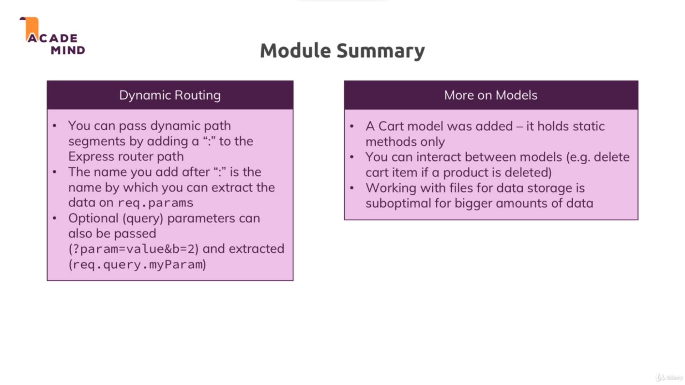

# Advanced routing : 

* To view the details of a particular item every item must have an unique identifier and we can use that identifier to search for that product.

* So what we do is that while saving the product to the database we add a unique identifier as a field to the product.

* So now every product has an unique id and we use that id in the route to display the product info of that product.

* We can extract the parameters added to an link using ':' with the route and use the passed parameter to access that data from the database.

* In our project we extract the product id and use it to find and display the product in the product details file.

* To add product to the cart we make a post request. To make a post request ( like in case of adding a product ) we can use a form with a post method and html will automatically give us the post request.

* In EJS the local variable in a loop is not automatically passed to an include file so we need to pass it explicitly.

* We listen to the post request and handle that post request in shop.js by adding the product with the id from the post request to the cart.json file and all the logic related to the addition of product to the cart is in cart.js.

* 
