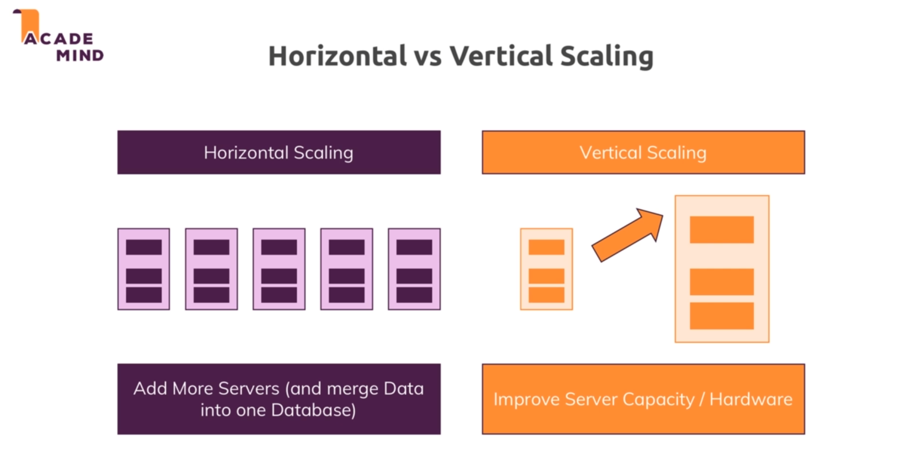

# SQL

## Databases :

* 

## SQL :

* SQL database thinks in terms of tables.

* And each table has fields/columns. We fill in the data for these fields called rows.

* SQL based databases allow us to relate different tables(Relations).

* 

* 

    * Data schema : how the data in the table looks like.

    * All the data in the table has to fit this schema.

    * Data relations : relate different tables with different kinds of relations.

* 

## NoSQL 

* NoSQL simply means that it doesn't follow the approach SQL follows and it also uses a different query language.

* In NoSQL tables are called collections but we can think of them as tables , or their equivalent.

* In collections we don't have records rather we have collections.

* NoSQL doesn't have strict rules like SQL.

* .

* In NoSQL we dont have relation.

# SQL vs NoSQL :

* 

* 

* If our application requires strong schema and has a lot of relation then we will use NoSQL.

