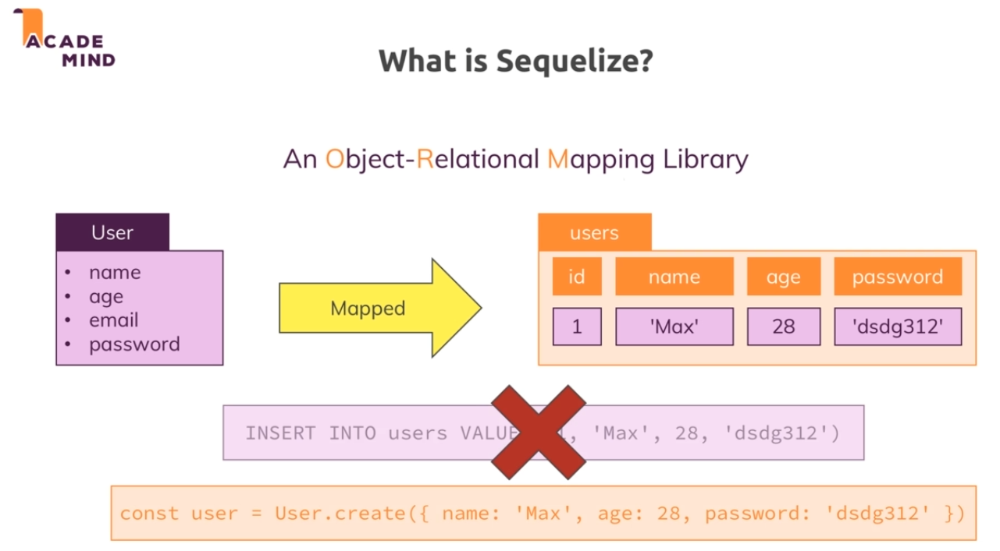
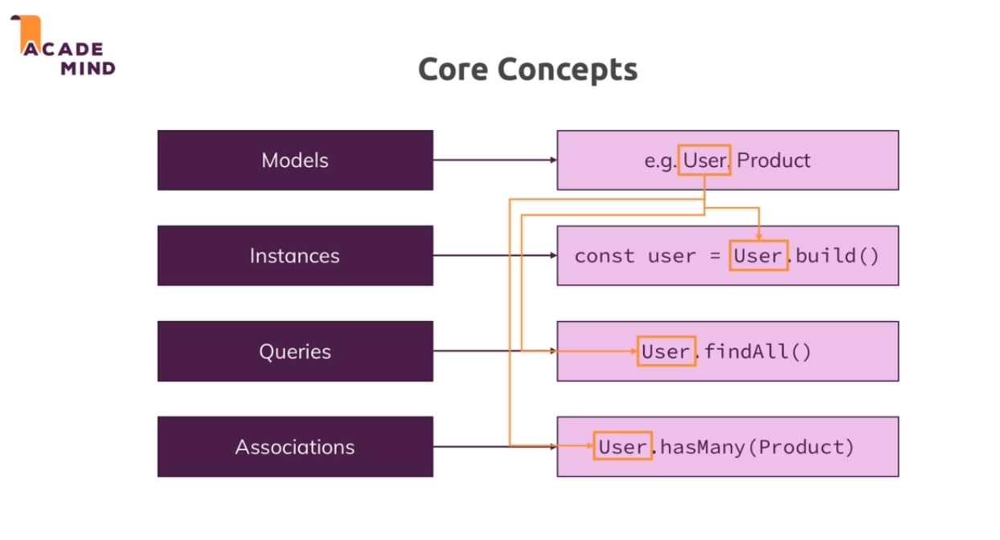
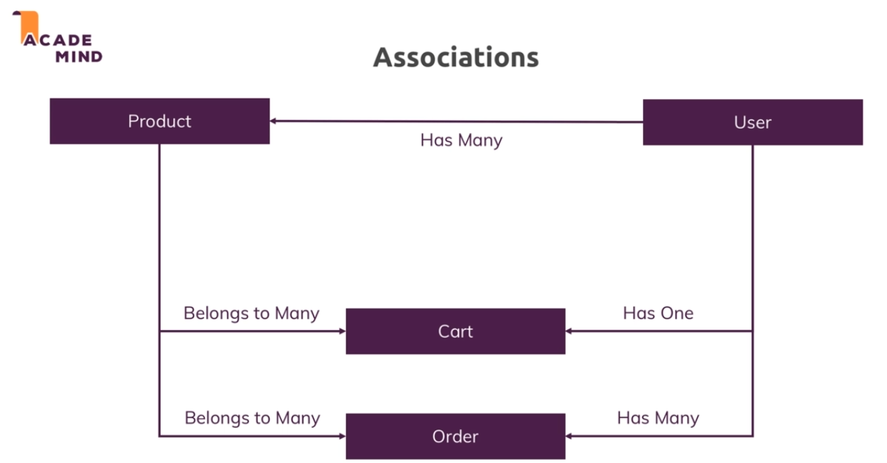
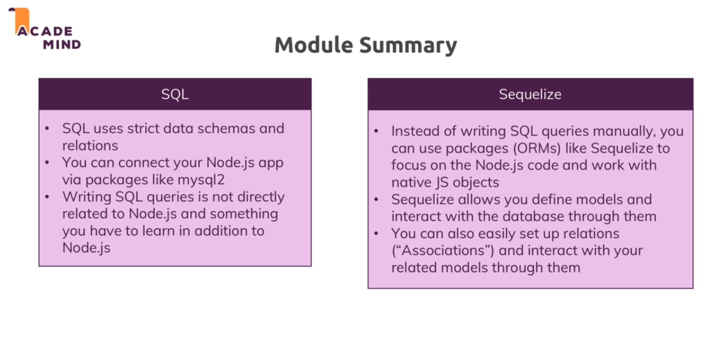

# Sequelize

* It is an object relational mapping library which simply means it does all the heavy lifting, all the SQL code behind the scenes for us and maps it into JS objects with convenience methods which we can call to execute the behind the scenes SQL code so that we never have to write SQL code on our own.

*  So it the above example the sequelize with take this object and create a table for us and set up relations for that table. 

* Also whenever we create a new user as in the above example , we can simply call a method on that user js object and sequelize executes SQL query that is requirred.

* Core concepts of sequelize : 

## Installation : 

* To install sequelize we run `npm i --save sequelize`. Also for sequelize to work we need to have the mysql2 library in our project.

## Model : 

* We can define a model but we need sequelize to create a table for that model to do that refer to the code in the app.js file.

## Associations :

* We can call these relations between different models/tables.

* 

## Module summary : 

* 

