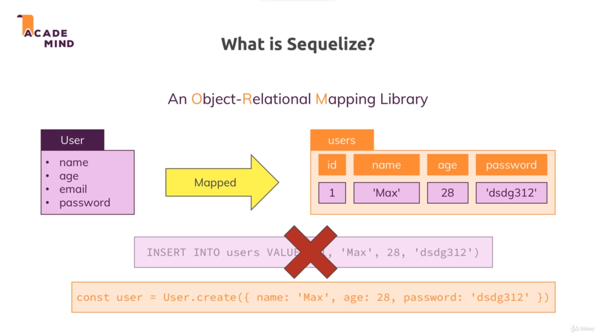
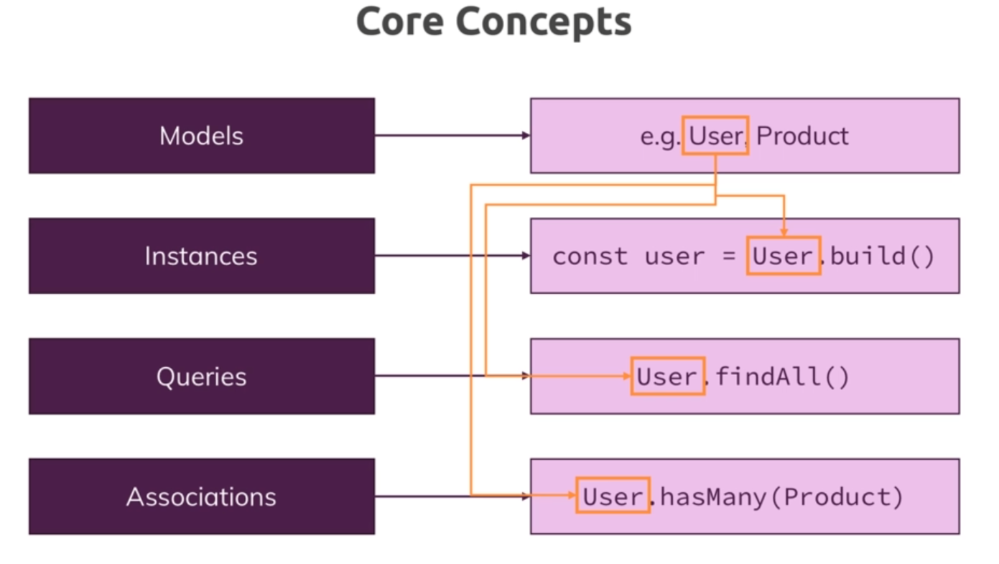

# Sequelize :

* 

* Sequelize is a third party package. It is an object-relational mapping library which basically means that it does all the heavy lifting, all the SQL code behind the scenes and maps it into js objects with conveniece methods which we can call to execute the behind the scenes SQL code.

* It takes a object and maps it into a SQL table. It automatically create the tables and sets up the relationships between the tables.

* And when we want to insert a new record into the table, we can call the create method on the model and sequelize will take care of the rest.

* 

* Sequelize offers us the models to work with our database and it allows us to define these models. It allows us to instantiate these models.

* Also we can run queries on our models and also allows us to have associations between the models.

## Installation :

* To install sequelize run `npm i --s sequelize`. TO USE SEQUELIZE WE ALSO NEED THE mysql2 package.

<!-- Continue with syncing JS definition to the database -->