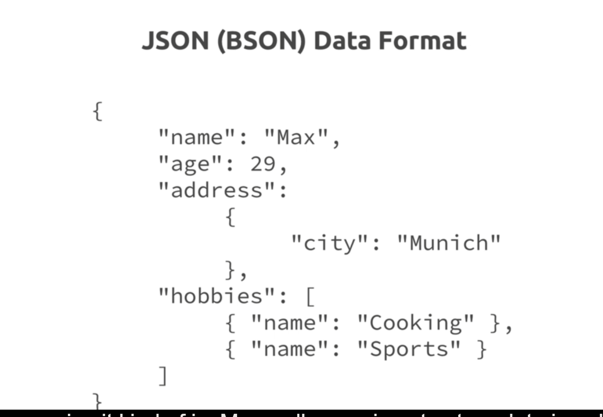
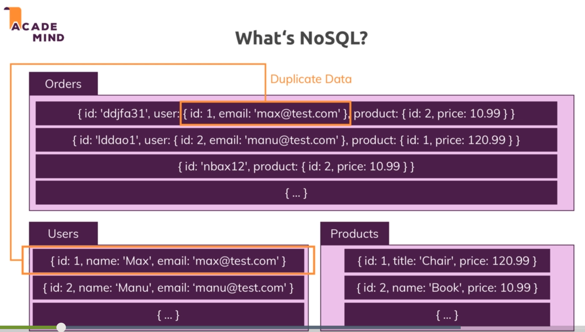
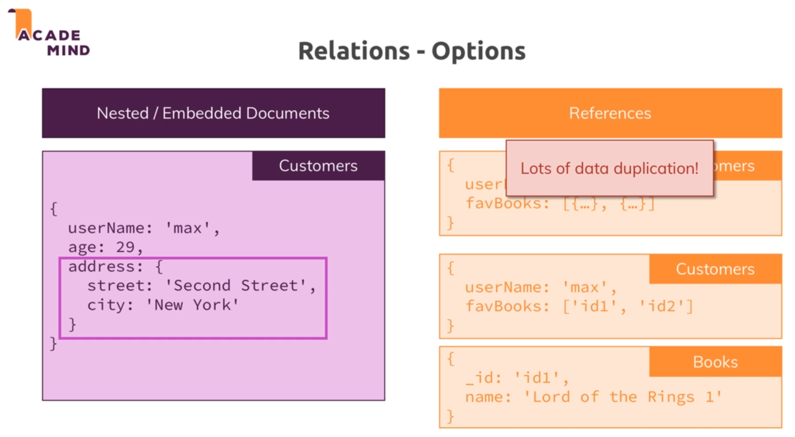
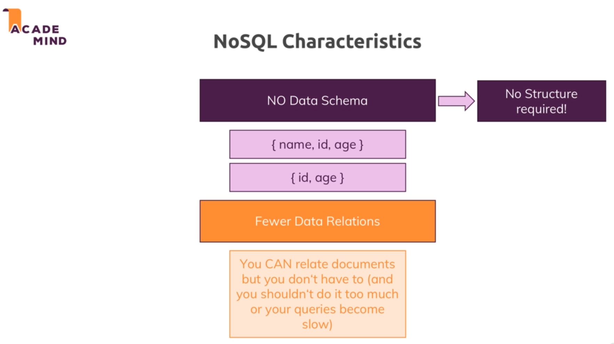
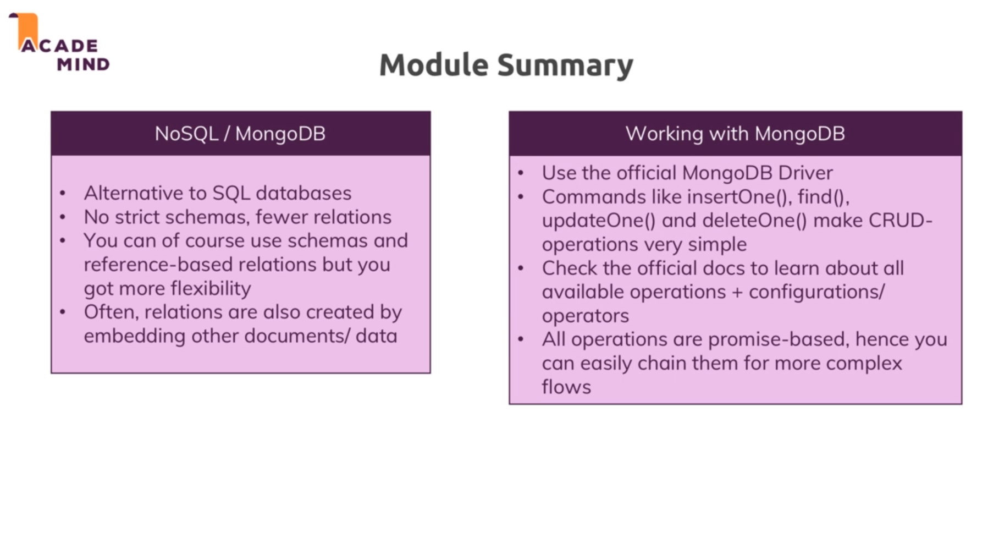

# MongoDB : 

* It is a NoSQL database which can be used to store and work with lots and lots of data so it is built for large scale databases.

* In MongoDB there is a database which contains multiple collections. And these collections dont have records but they have documents.

* 

* MongoDB is schemaless, inside of one collection, our documents dont have to have the same structure. In SQL that was totally different, every data entry has the same structure. This gives us more flexibility to work with.

* 

* The above is how a MongoDB document looks like and mongodb uses json to store data in collections so every document look something like this. 

* Mongodb actually uses BSON which is binary JSON. But that only means that mongodb kind of transforms this behind the scenes before storing it in the files.

* A mongodb document can have nested documents and array which in themselves can have nested documents and arrays.

## Relations in NoSQL : 

* 

* So the above example depicts a way to store related data in mongodb. It uses embedded documents. So a collection might hold a copy of another collections data in an embedded or nested document in another document in another collection.

* So instead of just matching by ID as we did in SQL here we can depict a relation by embedding data into other documents. And we don't have to match and fetch we can just directly fetch the copy of the requirred data.

* There are cases where embedded documents will lead to a lot of data duplication. In these types of cases we will need to work with that data alot and hence it would change alot and we will have to manually update every piece of data where it is duplicated. So using embeded documents is not ideal in such cases.

*  In the case described above it would be easier to still go with two collections and only store the references to the books in a customers.

## NoSQL characteristics :

* 

# Module summary : 

* 

