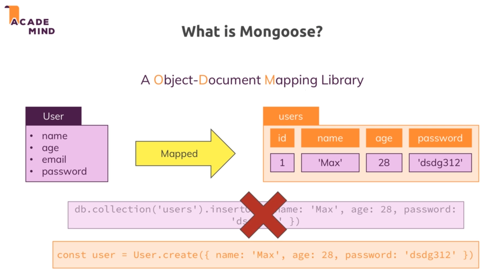
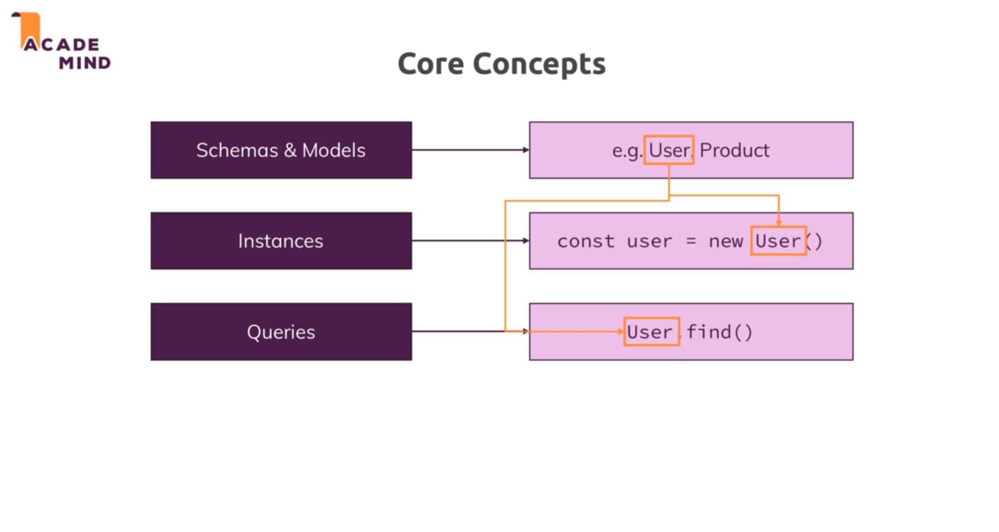

# Mongoose : 

* Mongoose is an object document mapping library similiar to sequelize which was a object relational mapping library for mysql. And this is obviously becuase mongo db is not a relation database rather an document database.

* .

* Mongoose allows us to focus on the logic rather than writing mongo db queries.

* Mongoose allows us to define models with which we can work and where all the queries are done behind the scenes.

* .