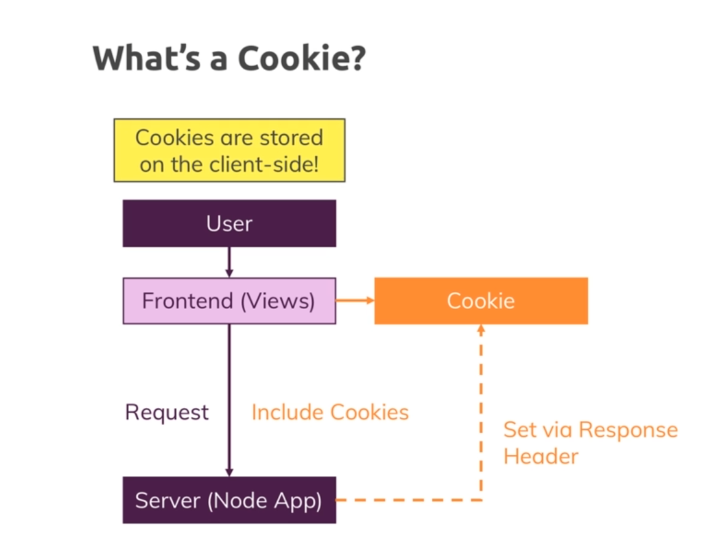
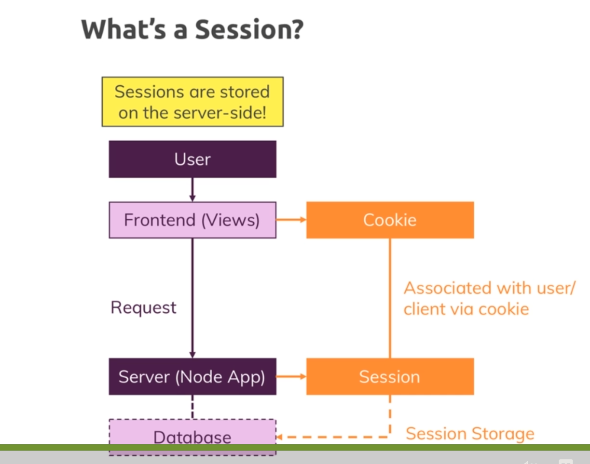
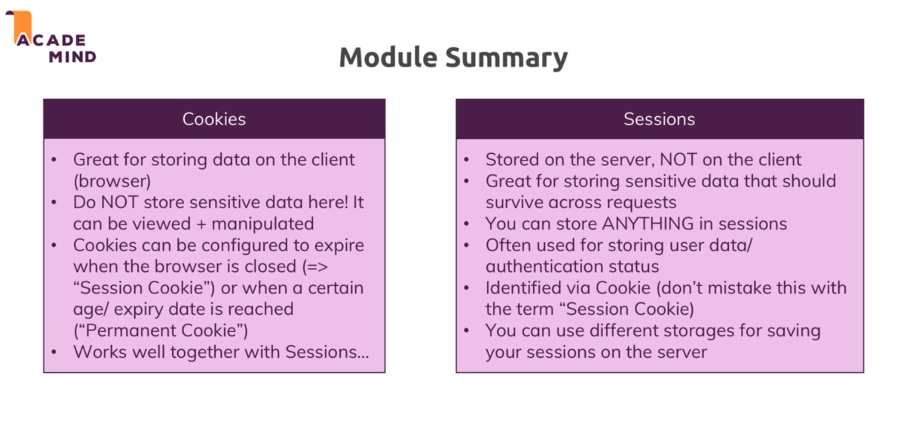

# Sessions and cookies 

* Used to persist data accross requests.

## Cookies 

* 

* We can send cookies to the client and those cookies will be included with the future request and we can use them to perform certain action like auth.

* Using a request for storing anything is not ideal becuase the request is dead after sending the response.

* An alternative is to declare a global variable and use it to store information but the problem with that is that it will be shared accross all request, therefore accross all users.

* This is where cookies help us , with cookies we can store data in the browser of a single user and store data in the browser which is customized to that user which doesnot affect all the other users. And this data can be sent with requests to tell about state of the user.

* So whilst it is interesting to store some data in the client side especially things related to tracking and advertisement , sensitive data should not be stored in the browser becuase users can edit them.

* Cookies have following important options : 

    * Expires: The time when the cookie will expire.

    * Max-Age: The time after which the cookie will expire. (how long autheticated session will last)

    * Domain : the domain to which the cookie should be sent.

    * Secure : means cookie will only be set if the page is served over https.

    * Http-Only : means cookie will not be accessible from client side javascript so scripts running in the browsing.

* Often we do not directly set the cookies ourselver rather we use packages that will manage settings the cookies for us.

# Session : 

* 

* In case of sessions, instead of storing the information that the user is authenticated in the frontend which is not secure, we store the information in the backend with sessions.

* But we also need one important piece of information from the client , who need to tell the server to which session he belongs because the session will in the end will be an entry stored in memory or stored in database.

* Now we do not match this by ip address or anything like that because they can be spoofed.

* Instead we will use a cookie where we will store the ID of the session. And we cannot change this id from the frontend because actually the value we store will not be the ID but the hashed id. And only the server can confirm that it has not been fiddled with.

* So this is a secure way because we store the id in a hashed way. 

* So we will match a session using the server and that session can then contain the confidential data which client side can't change.

* So sessions are stored on the server side and cookies on the client side.

* To maintain sessions we use `express-sessions`.

* By default session is stored on memory and for production not the best option so we will use mongo to store sessions.

* And to use mongodb with sessions we will use `connect-mongodb-session` package and register mongo as a store.

* So we configure a mongodb store and then pass it to the session middleware.

* All the cookie parsing and setting is done by express-session.

# Module summary : 

