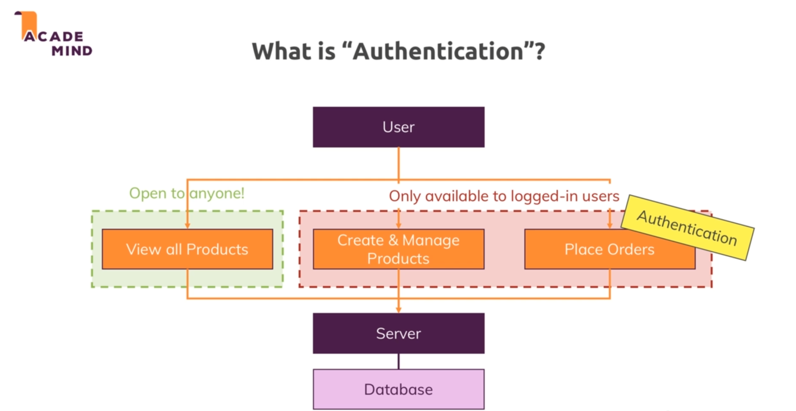
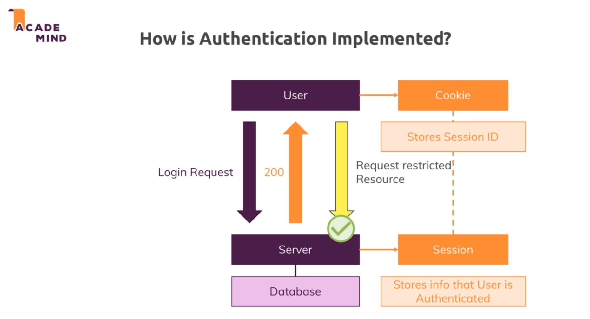
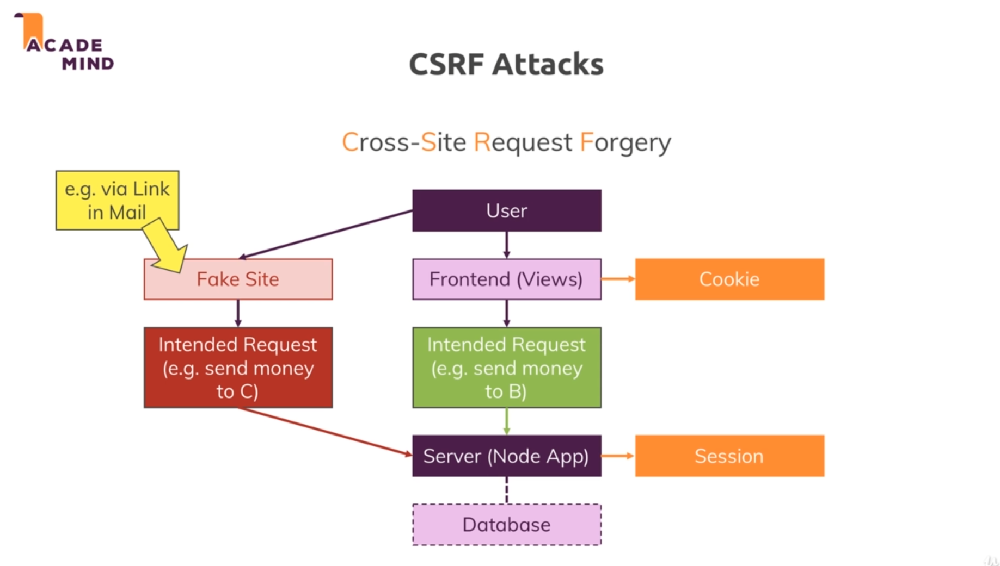
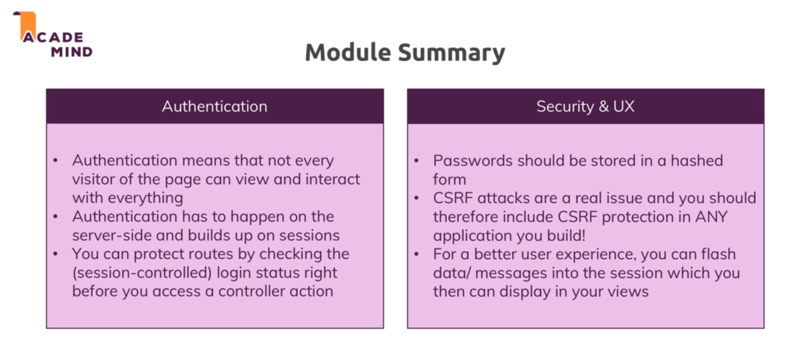

# Authentication 

* 

* 

# CSRP Attacks : 

* 

* This type of attack make use of a session to make a request without telling the user and for malicious reasons.

* To prevent this types of attack we make sure that our sessions are only available on our pages and not in other websites or ones which might look like ours.

* To add this we use a CSRF token.

* CSRF basically a string value we can embed into our forms. so into our pages for every request that does something on the backend that changes the users state. Like ordering something.

* And on the server `csurf` package will check if the incoming request does have the valid token.

* So the fakes sites won't have this token and hence the backend will not apprvove the request generated by them.

* So we first add the csurf middleware and then to every post request we pass in a hidden input will the name `_csrf` and this value will contain the token ensure that our post request work successful.

## Error handling : 

* To display error messages to the user we store the error messages in the session and then destroy them once they are retrieved .

* To perform the above operation we use use the `connect-flash`.

* We first need to initialize that package in our app.js file.

## Module summary : 

* 