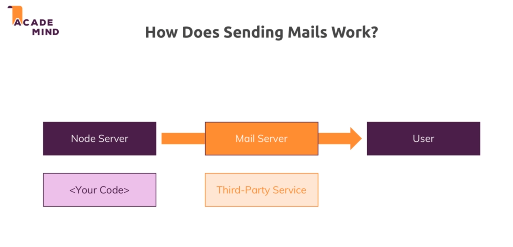

# Nodemailer 

## How does sending mail work?

* Its important to understand the nodejs or expresjs are languages or frameworks runtimes that we use for writing our server side logic but will nodejs we can't trivially create a mailing server. Handling mail is different from handling requests and responses.

* So in reality we never implement our own mail server because it is a very complex task. And we typically use third party mail servers for that.

* 

* So every application uses third party mail servers for sending mail.

* We will be using hotmail to send mail.

* To send mail using nodemailer we first need to install the package.

* Then we setup a nodemailer transporter object. Which includes our email and password.

* Then we call sendMail function on that transporter object to send the mail by passing in the mail options.

* We should try sending the mail in a non-blocking way since sending a mail might take a lot of time.