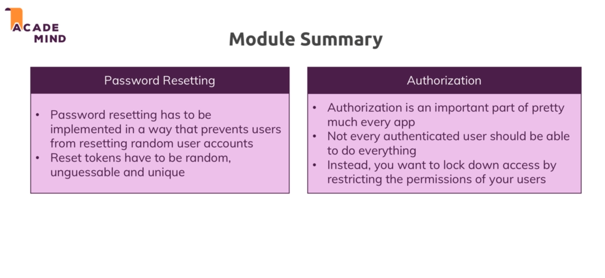

# Advanced authentication :

## Reset password :

* In this module we add the option allow the user to reset his password.

* To do that we first redirect him to page where he has to enter his email id.

* Add he does that we check that he has entered a valid email id. If he has he is sent a mail with a reset password link which contains a token in its params.

* We use this token to make sure that user is the one the account belongs to.

* Add he adds a new password we change the password in the database.

## Authorization :

* We do not want the user's who did not add a particular product to edit or delete that product.

* To do so we some checks in admin getProducts and also in the post requests of edit and delete to prevent him from doing so.

## Module summary :

