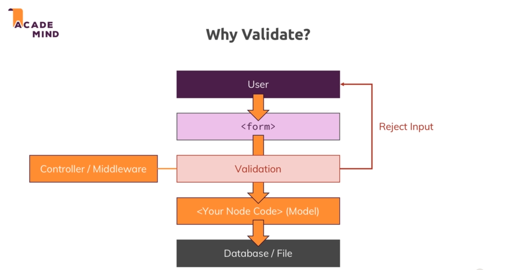

# Validation : 

* 

* Currently we are not checking whether the data user entered is of the required form or not so this allows us to sign in without any validation.

* So we now need to make sure the data user entered is of the required form.

*  

* So we must validate the user input on the server side and also for good user experiance we must not erase the data entered.

* To validate our data we will be using the package called `express-validator`.

* We can add `novalidate` to our form to stop frontend validation.

* <b>Generally logic behind validation is that we put all the syntax related code in routes and logic related code in controllers.</b>

## Sanatizers :

* The `express-validator` package also has what are called sanatizers. Then are used to ensure that our data is of the required form. 

* For example if we want to ensure that the data is a number then we can use the `isNumeric` method. Or we want to remove the white spaces from the data. Or normalize the data.

* So they are used to make sure that the data we get is not only valid but also stored in a uniform way.