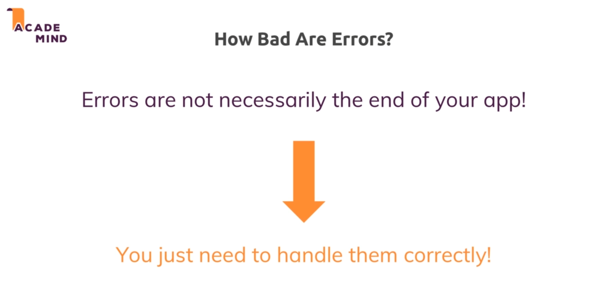
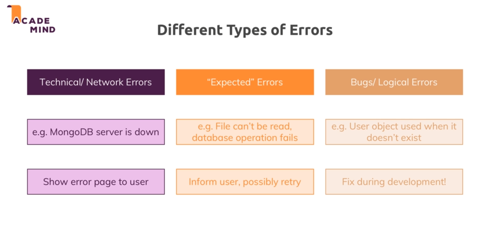
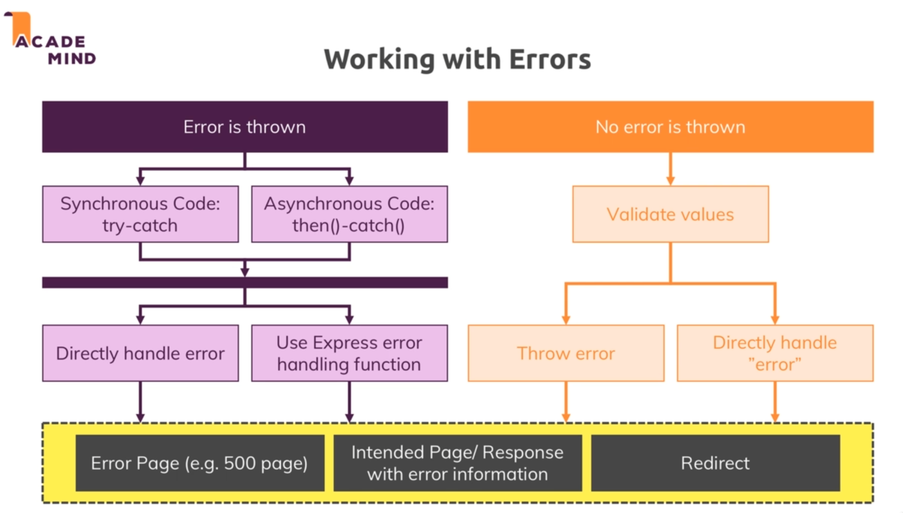
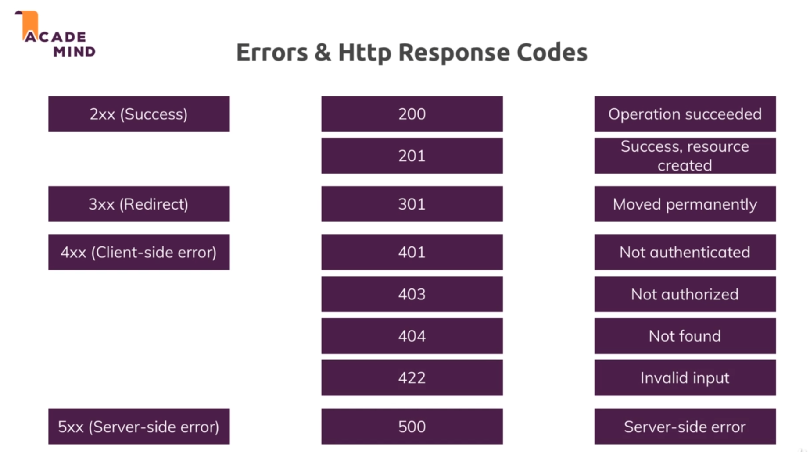
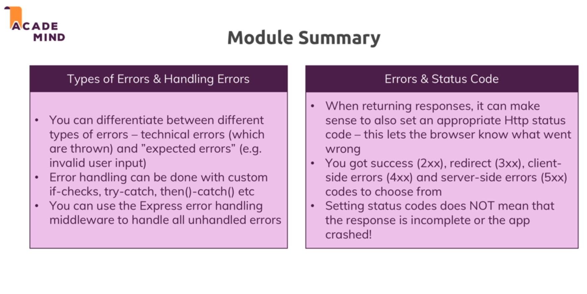

# Error handling :

* 

* 

* Types of errors :
    * Technical errors : eg: mongodb server is down. Not much we can do about this so we just display to the user that something is wrong on our side through an error page.

    * Expected errors : certain operation which can fail , fail. Inform user and ask them to retry. Validation errors are a type of expected error.

    * Bugs/logical errors : should be fixed during development.

* 

* Dealing with error requires us to sort our 2 conditions :
    * Error is thrown : using a throw error statment. For such errors we have certain tools we can use and catch them. For sync code we can use try-catch and for async code we can use then()-catch(). Further we can either directly handle them or use express error handler.

    * No error is thrown : no error is thrown but we know we can't continue further. For these we need to check using if statements and then decide whether to throw an error or if we want to directly handle the error.

* In all the above cases we can do one of the following three :

 * Error page : display a error page , but this should be our last ressort since this leads to user losing all the earlier entered data.

 * Intended page/response with error info : display the error info on the page itself just like the validation part.

 * Redirect : for example a page which just is not allowed to access in such a case we can simply redirect the user.

* To handle errors we can add the error handling middleware but :
    * Outside of async code we just throw the error and express will use the error handling middleware using next(error).

    * Inside of async code we need to use the next(error) function to handle the error.

## Erros and http status codes:

* Codes are extra info we use to tell the browser if the response succeeded or not.

* If we are using alot of frontend js and are fetching apis error codes help us in debugging. 

* 

* More error code : https://developer.mozilla.org/en-US/docs/Web/HTTP/Status

* An error doesn't mean that app is broken. It just means that the request failed.

* Status codes are very helpful in rest api's since we don't send views there and have to convey errors through status codes.

## Module summary :

* 