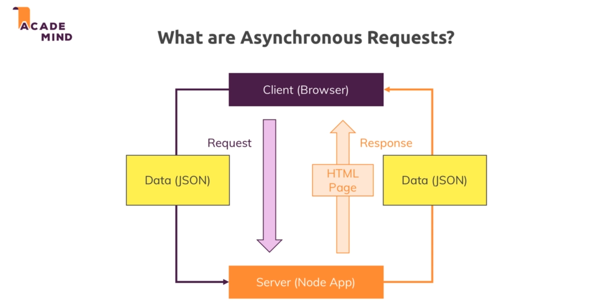

# Async requests : 

* Till now we have only made requests using browser and response was either a redirect or a html page.

* But sometimes we need to perform certain requests which only happen behind the scenes. So we dont want to exchange a HTML page rather we just want some data from the server.

## What are async requests?

* The idea behind async requests is that we do send some requests to the server and but that request typically contains just some data in a special format names JSON and the data is sent tot the server to a certain route.

* The server works on the data and then returns a response.

* This is how client and server communicate through client side JS and a server side logic without reloading or rebuilding the page.

* 