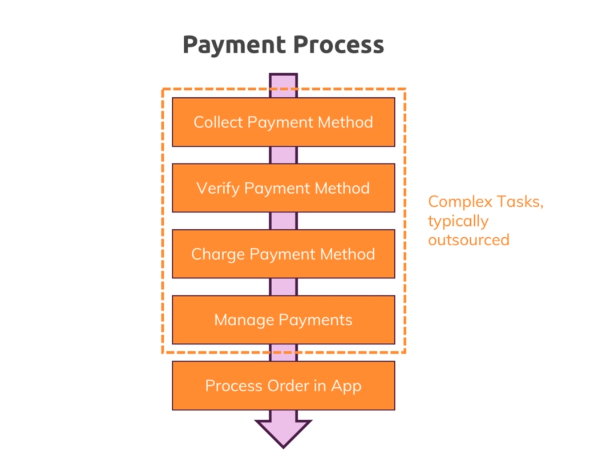

# Payments : 

## How payment works ?

* 

* All the payment related tasks are very complex so we usually outsource them, for doing that we use stripe.

* 

* We collect the payment information from the user and send it to stripe. Stripe then validates the information and returns a token. Container the info about payment and whether its correct or not.

* Then we pass the payment info to stripe and get the response.