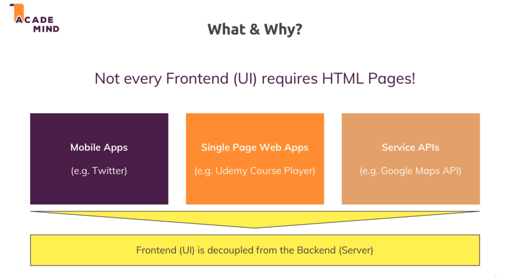
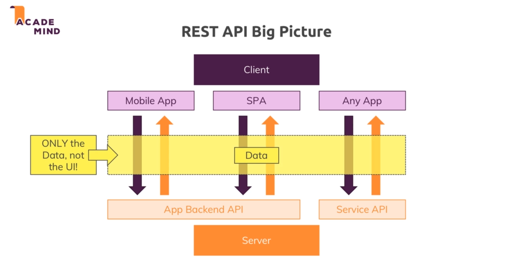
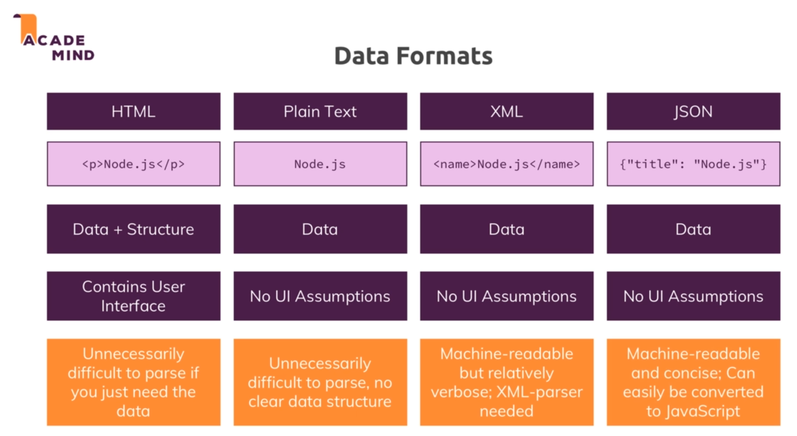
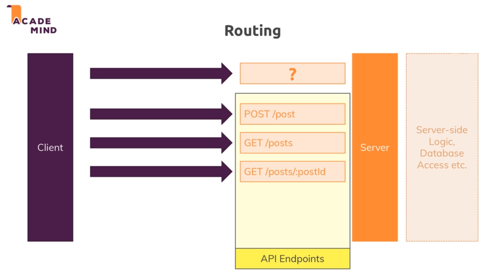
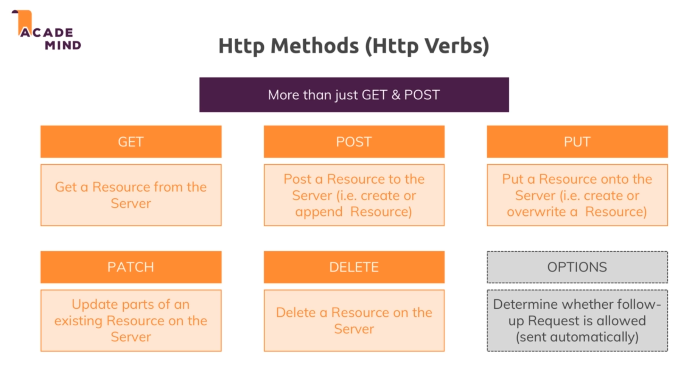
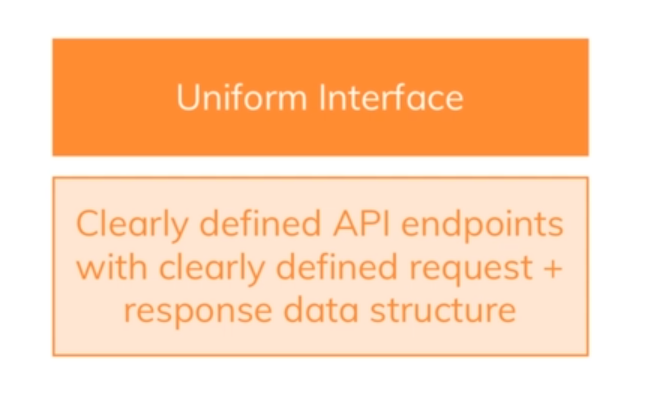
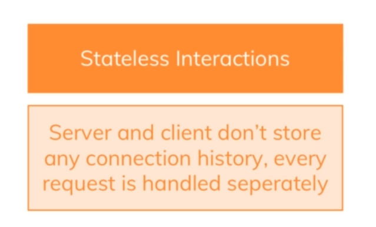
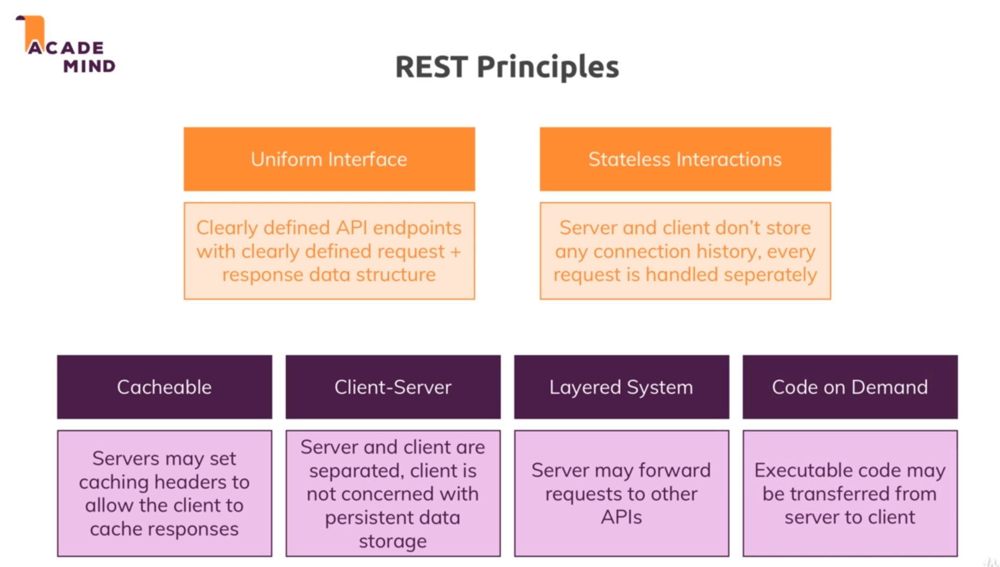
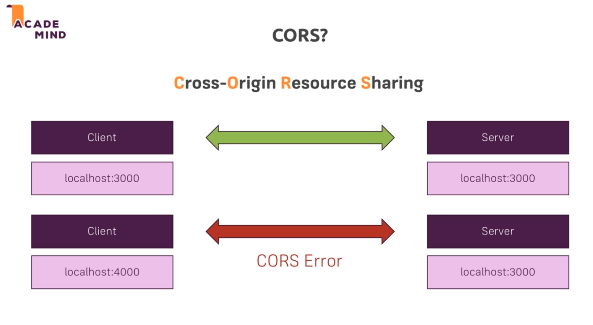
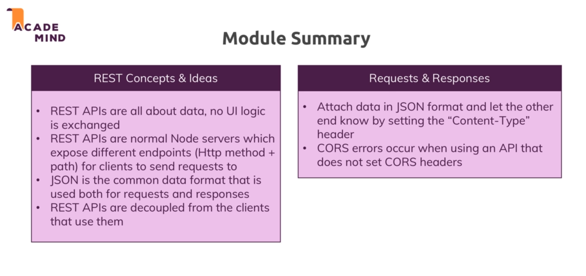

# Rest API :

* Not every frontend requires HTML pages. Eg: Mobile apps, bots, etc.

* So we build such types of application such that they are totally decoupled from the server. And we dont want the HTML code because we dont want to render that on the client.

* We only need data to fill they user interfaces.

* Another example where wee dont need to render HTML content is single page applications. Such applications only fetch the HTML page once and then use the js script to fetch data from the backend and render that to the user interface. 

* 

* So when we have a front end where we have code that is decoupled from the backend and we only need to exchange the data becuase we dont want to get any user interface, we built that on our own.

* We just need a backend so as to serve us data and that is a core idea of building rest apis.

* .png)

* So in REST APIs we just serve the data and leave it to the client on how he wants to the represent that data.

* So for rest apis only the response changes the rest of the logic remains same.

* 

* 

* JSON is what we will be using to exchange data.

## Routing : 

* 

* In REST API's the endpoints are the http methods and the respective paths.

## HTTP Methods :

* When working with browser only GET and POST are allowed. These are the 2 methods the browser natively knows or browser HTML element know.

* When using async request through JS or using mobile clients we have access to more HTTP methods. 

* 

* Its a good practice to use these method in their respective ways but we are not restricted to perform different operations from those defined above on a specific method.

## REST Principles : 

* Principles of REST are :

    * Uniform interface : * 
                          * API should be predicatable and well document if possible.
                          * Thing that happens when we reach an end point should be predictable.

    * Stateless interaction : * 
                              * No connection is stored so every request is treated independently.
                              * Does not store a session for a client and does not maintain state.

    * Rest of the principles : 
                    

## Cors :

* Cross-origin resource sharing.

* 

* This means that we can share resources accross different domains and ports. But we can overwrite this error.

* CORS errors when the API and our client are on different service, different domains and they want to exchange data.

## Module summary : 

* 