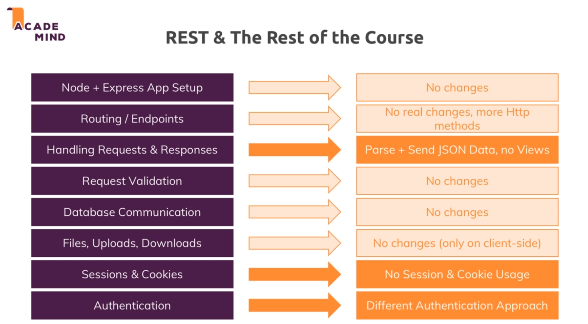

# Advanced Rest APIS:

* 

* We dont use cookies and sessions in REST APIs because as we discuss all the requests are independent of each other and we dont maintain any state.

* This project contains only the client side code and contains no server side code. It is an react app and has only react dependencies , still to install them we need to run npm install.