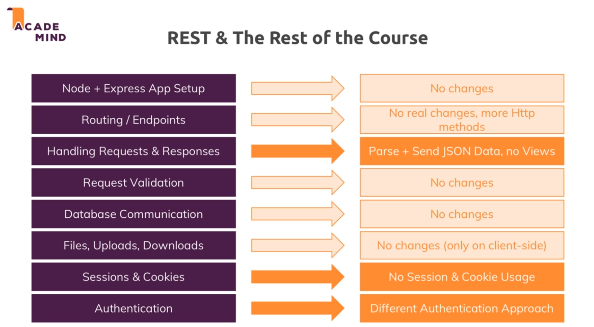
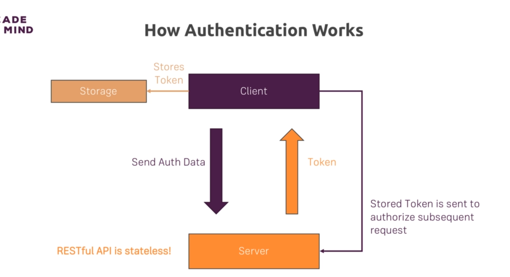
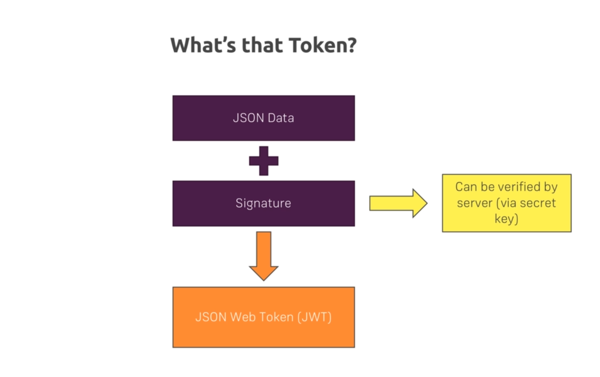
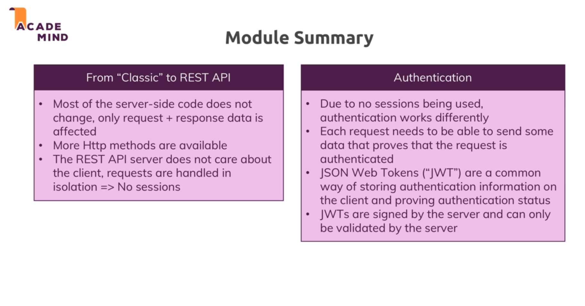

# Advanced Rest APIS:

* 

* We dont use cookies and sessions in REST APIs because as we discuss all the requests are independent of each other and we dont maintain any state.

* This project contains both the client side code and server side code. The client side is a react app and has only react dependencies , still to install them we need to run npm install.

* Client side validation is not safe since it can be edited by editing the user side js.

## Authentication : 

* We dont use sessions in REST APIs and hence every request must carry authentication data. As the server will not store any data about the client.

* 

* So the client will send the auth data and the server will validate it. After validation the server will send a token to the client which it will store in the browser. And client can attach this token to every subsequent request it sends to the server.

* So the client will send that token and client cannot fake the token since its generated with a particular algorithm is very hard to crack.

* 

## JWT:

* To pass our jwt token to our server we add it as header in the requests.

* Also for the headers to be read we need to add our Header key to the 'Access-Control-Allow-Headers' in the server. So that this header is allowed to be access by the server.

## Module summary :

* 