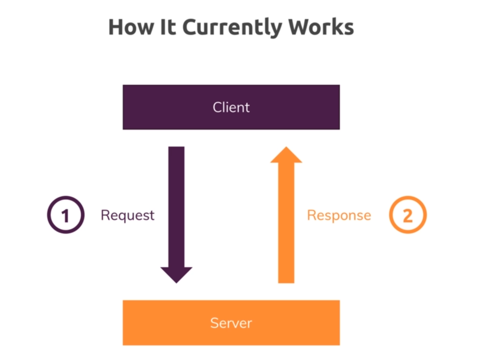
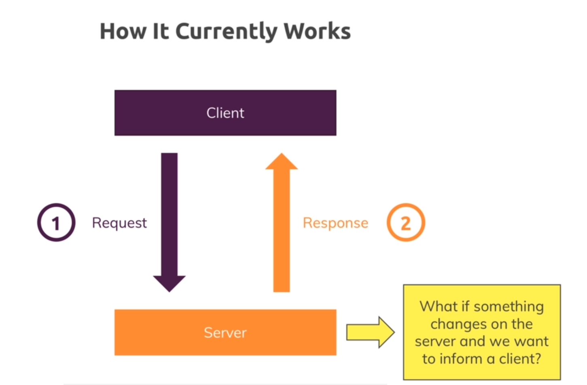
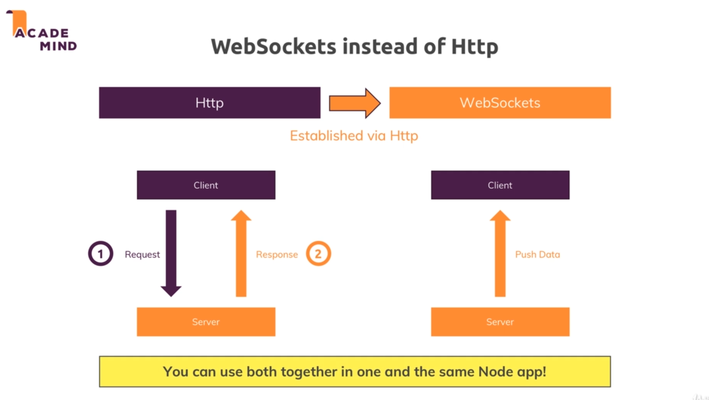

# Websockets and Socket.IO :

* Our approach (pull approach) till now : 

* 

* In this new approach called push approach if something changes on the server side and we wanted to actively inform the client (for example in a chat app).

* To do this above task we will be using the websocket protocol instead of the HTTP protocol. 

* Websockets are built up on HTTP , they use a HTTP handshake to upgrade the HTTP protocol to websocket protocol and the websocket protocol simply determines how the data is exchanged.

* 

* Websocket just like HTTP can be used to send data from client to server but it can also be used to push data to the client from the server.