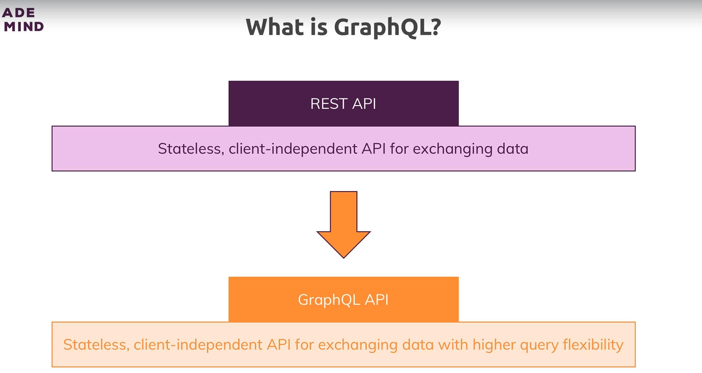
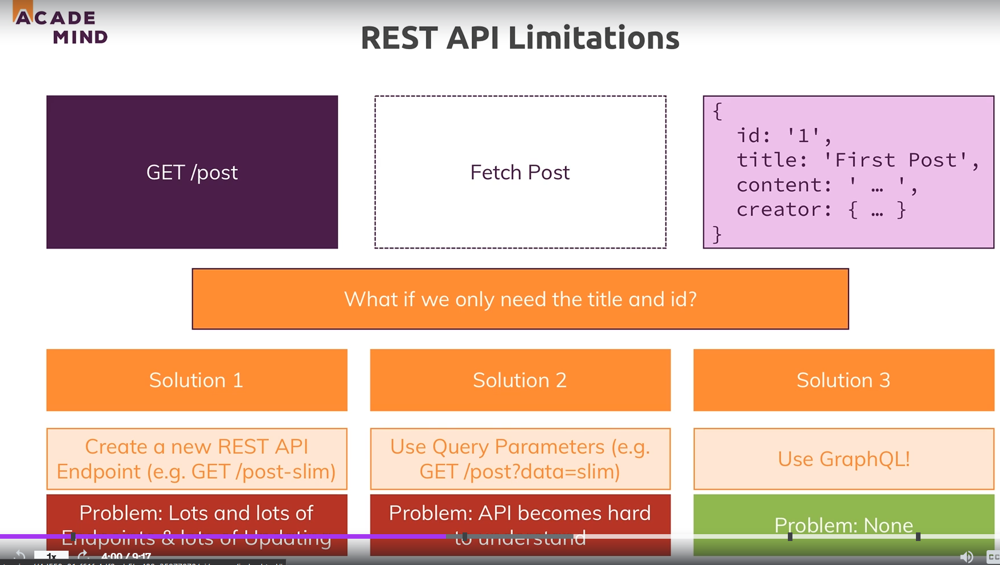
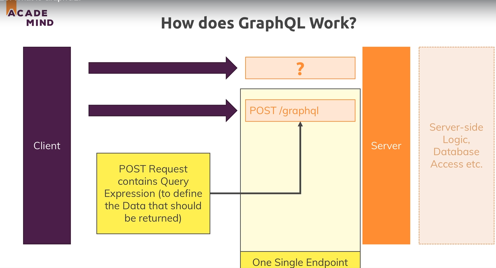
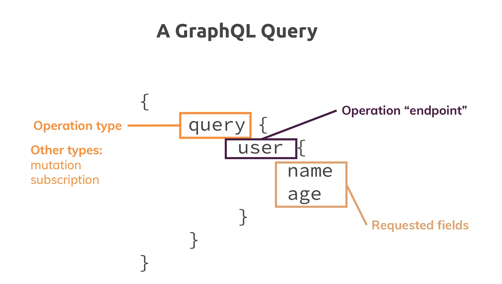
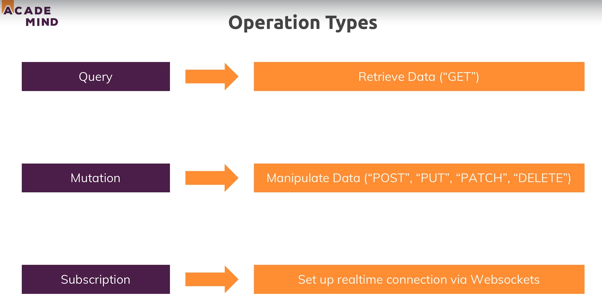
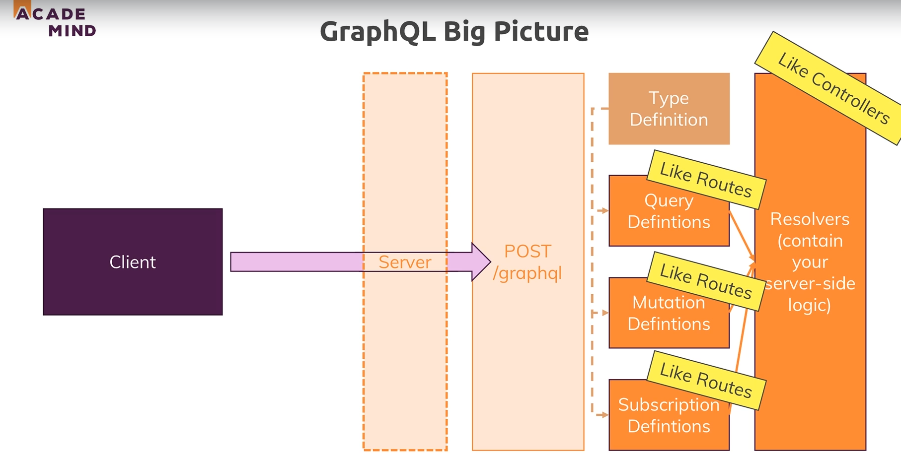
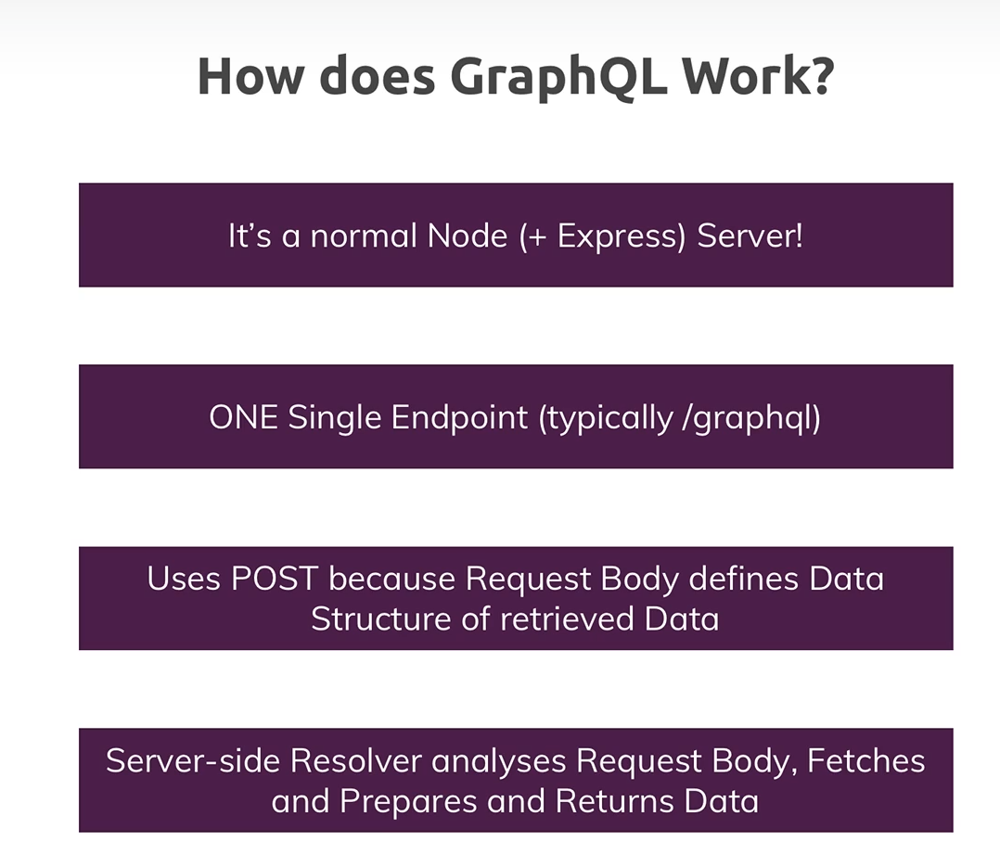
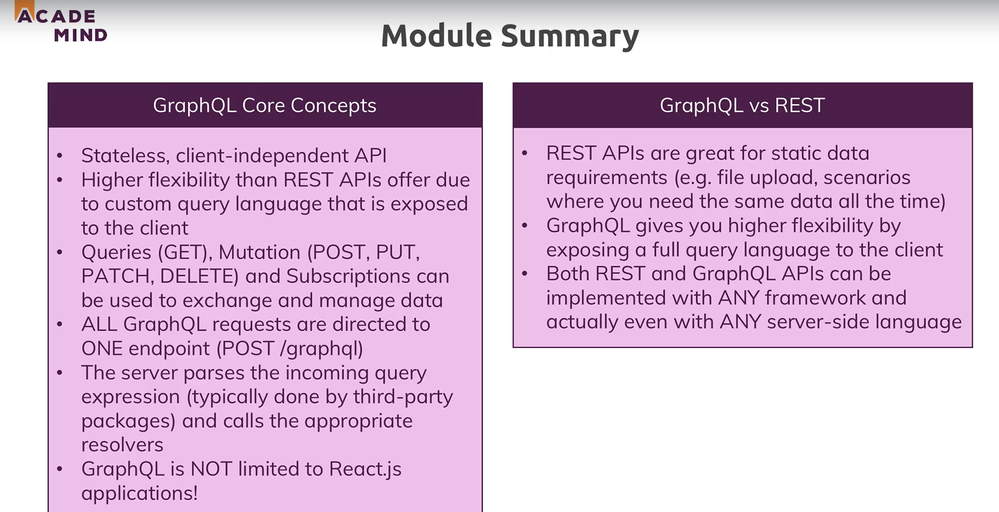

# GraphQL :

* REST on steriods.

* 

* If we only want to get some selective data from a request then we can follow one of the following approaches : 

    * Create new endpoints for each data we want to get. But this will lead to many endpoints.

    * Use query parameters to get data. But then the api becomes hard to understand.

    * Use GraphQL.

* 

* In GraphQL we have a rich query language that we can use in our frontend to send request to our backend.Which is then parsed on the backend and then dynamically retrieves just the data we need.

* Its almost like a database query language.

* In graphql we only send one kind of request. That is a post request to /graphql. So we just have a single endpoint where we send our http requests to, even for getting data.

* 

* In graphql we put our query request in our post request and send it to our backend. Which will be parsed and then returns to us the requirred data.

## GraphQL  query :

* 

* JSON object type structure.

* Operation type : The purpose of our query. Following are the 3 operation types :
            
    * query : To get data.
    * mutation : for editing, inserting or deleting data.
    * subscription : for setting up realtime data subscriptions using websockets.

* Endpoints : endpoints or the command can be defined and executed on the backend.

* Field : there are field we want to extract and that is the flexible part.

## GraphQL operation types :

* 

* 

* So in graphql we setup the definition of the operation types. And these definition are typed since graphql is a typed query language which mean we need to define the type of data we work with.

* And we connect these definition with the resolvers which contain our server side logic.

* 

## Installation :

* To install graphql run `npm i --s graphql express-graphql`.

* graphql: will be used to define schema of the graphql query.

* express-graphql: will be used to parse graphql query.

## Validation :

* To validate the user input we use validator function which is what express-validator used as well.

## File upload : 

* To upload file we add a normal put route which stores the image on the server and then returns the name of the file to graphql query.

* And then redirects to the rest of the graphql request to store the information.

## Module summary: 

* 