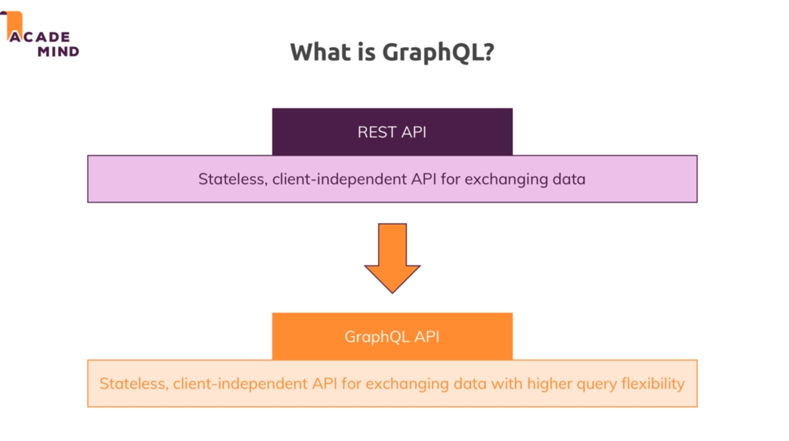
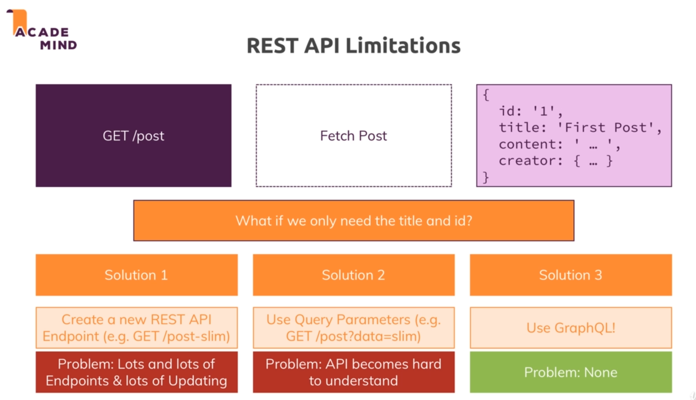
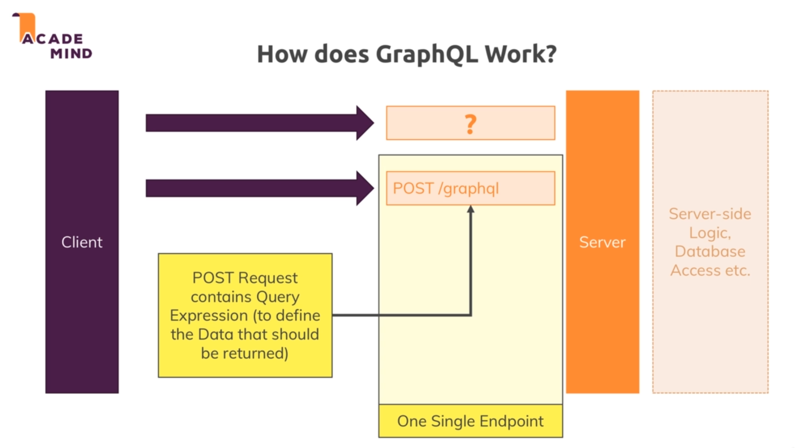
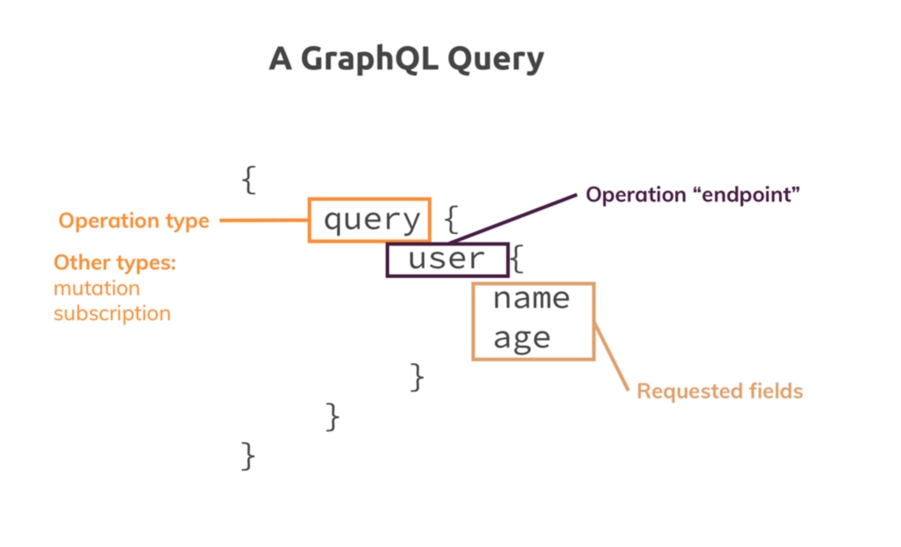
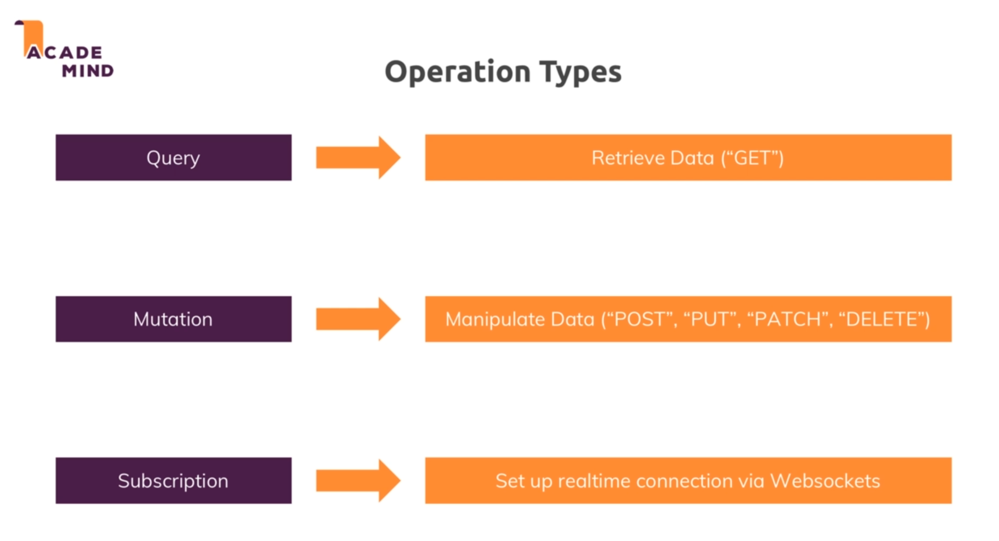
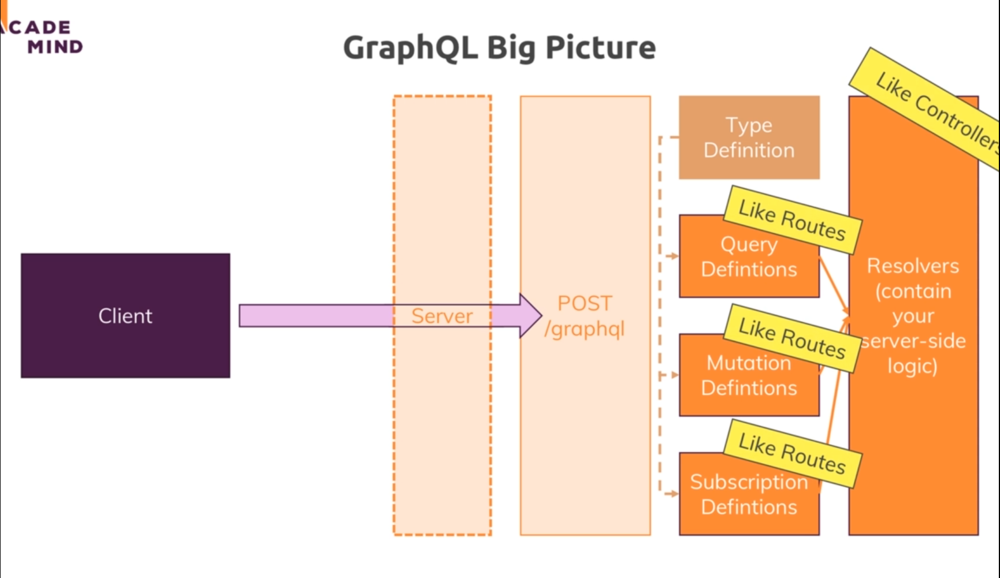
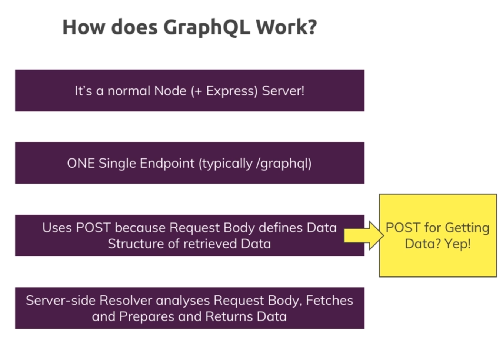

# GraphQL:

* 

* 

* GraphQL is ideal for the apps which have different data requirements for different pages.

* GraphQL has a rich query language which can be used in the frontend to send to the backend. Which then can be parsed in the backend and dynamically retrieves just the data we need.

* So its almost like a database query language for the frontend.

* In graphQL we only send one kind of request that is POST , to /graphql. So we have only one single endpoint that we refer to for getting data.

* 

* So we send the POST request containing the query expression to retrieve the data and return only the data we want.

## A graphQL query :

* It has an object like structure.

* The query has an operation type for example : 
    * query : for getting data
    * mutation : for updating data
    * subscription : for listening to data changes (setting up realtime data subscription)

* We can have the operation endpoints and the fields we want to extract from the data.

* 

* WE ONLY USE POST REQUEST FOR THE REQUESTS IN GRAPHQL : 

* In backend definitions for query, mutation and subscription we have a typed definition because GraphQL uses a type query language which means that we define the type of data we work with , the types of data we return in our queries.

* 

* 

* We will use some third party libraries for parsing the request. 

* To add graphql we install two packages : 'graphql' and 'express-graphql'