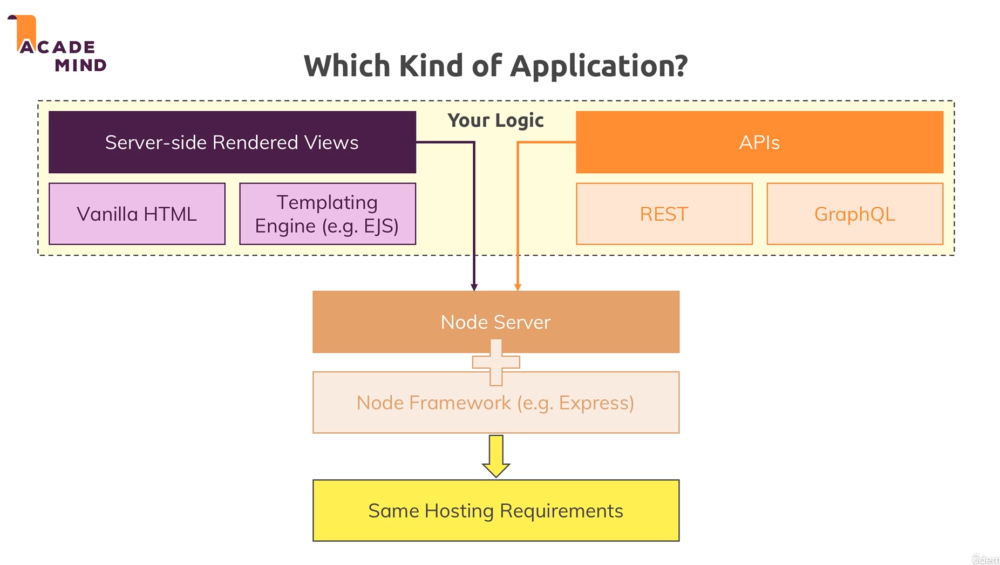
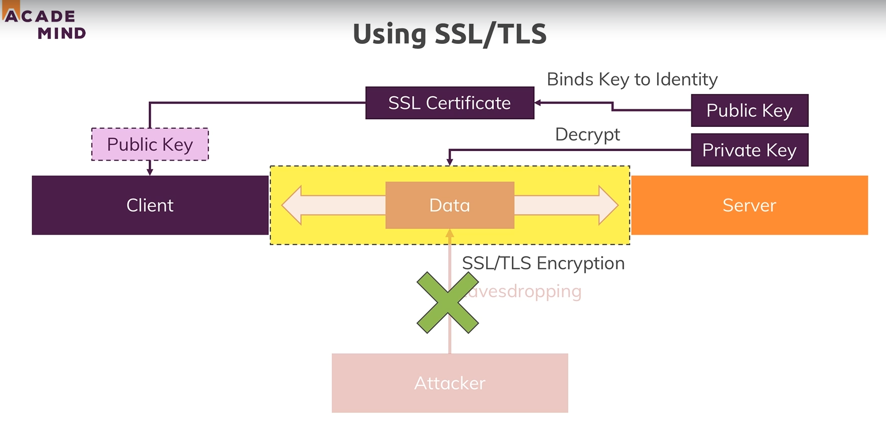
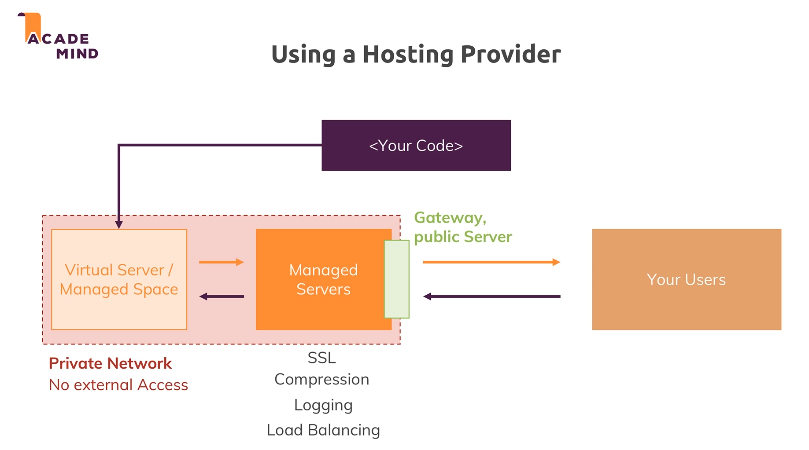

# Deployment :

* 

* 

* We use helmet to secure your node express application and what this package does is that it will add certain headers to the responses we send back and it follows best practices for doing so.

* And we can use it by installing, requirring and then adding this line to our app.js `app.use(helmet());`.

* Helmet docs at : https://www.npmjs.com/package/helmet

* Now we want to compress the files we serve statically and for that we use the node `compression` package.

* To add the compression we install , require and then use the compression function as a middleware in our nodejs app. This is the simple way of adding it but we can also add more options which can be refered to by the docs.

* Compression docs at : https://www.npmjs.com/package/compression

* This is worth considering in app where we have a lot of css and js which we are serving statically.

* Most hosting provided support and provide asset compression. But in case we are setting up our own server we can use the compression package.

* Now we also add logging to our project and we do that by adding a package named `morgan` which is a package which makes logging request data really simple.

* To use it we install , require and then add it as a middleware by calling `app.use(morgan('combined'));` and passing the information on how to log the information. And we can find more in the official docs that simply defines what data is being logged and how it's formatted.

* Morgan docs at : https://www.npmjs.com/package/morgan

* We can also write the logs to a file by passing in a write stream to the stream option in the morgan function.

* But again usually logging is done by the hosting provider.

## Setting up a SSL server :

* 

* We use SSL to prevent someone from eavesdropping on clients data.

* We do that by using SSL/TLS encryption. This uses a public and a private key to encrypt the data.

* We dont have to protect the public key however we need to protect the private key and it will only be known by the server becuase the private key will later be important for decrypting the data and the public key will be used for encrypting the data.

* In a SSL certificate we bind the public key to the server identity which is something like the domain , the admin email address etc. We create that identity when we create a SSL certificate. And hence the SSL certificate therefore connects a public key and a server and sends that to the client, to the browser so that the client also is aware of the public key.

* Hence we need a SSL certificate to be created. This certificate can be created by a certificate authority or by us. But if we create it the browser does not actually trust that information in there is correct and that is when we get warnings like this page uses SSL but doesn't seem to be secure. Hence we need certificate from the certificate authority.

## Creating a SSL certificate :

* To create a SSL certificate we run openssl command line tool. Then we run the following command : `req --nodes -new -x509 -keyout server.key -out -server.cert`.

* Then we enter the required info and SET THE COMMON NAME TO localhost otherwise the certificate will not work because the certificate has to set to our domain. And if we were to deploy this app on a server and use example.com for hosting name then we would have to set this to example.com.

* After this we find two files on our server ,server.key : the private key and server.cert : the public key or the certificate.

* Now to use it we read these files synchronously and then we add them to our SSL configuration. Which can be done by importing https and adding the following lines to our app.js file : `https.createServer({ key: privateKey, cert: certificate }, app).listen(process.env.PORT);`. This allows us to spin up a https server and till now we were using a http server in app.listen.

* To create the https server we pass in two arguments the first one configures the server and here we point it to the private key and certificate. And the second argument will be our request handler which will be our express app. 

* But the browser will not trust this certificate and will warn us that it is not secure.

## Using a hosting provider :

* 

## Version control :

* 

## Heroku :

* We need to use compression for heroku because it doesn't provide that service.

## Mongo DB IP whitelist : 

* After we deploy our app on heroku we need to add the static ip to the whitelist but heroku does not provide that. So we need to allow access from anywhere.

