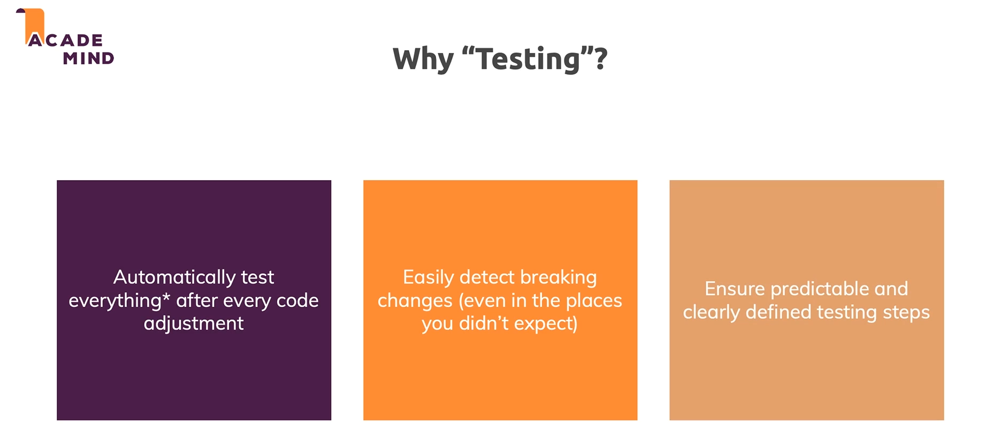
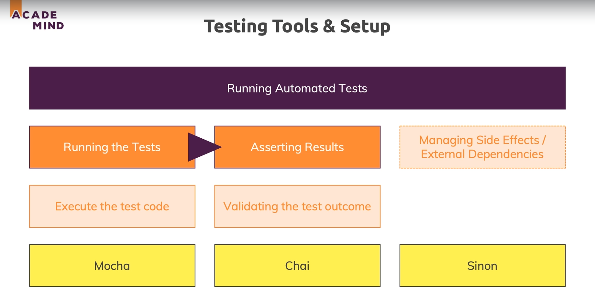

# Testing :

* 

* So we need a combination of both manual testing and automated testing which will help to successfully test our applications.

## Why testing ?

* Automatic test allow us to test everything (atleast the tests we define) after every code adjustment.

* 

* 

## Setup and writing tests :

* Testing different kinds of node applications like GraphQL API require different tests.But here we learn the core ideas, the core concepts, the way of thinking about testing and the general setup which will always be the same no matter which node application we are building.

* To install mocha and chai run `npm i --save-dev mocha chai` which will install them as development dependencies.

* Then we add the command "test:mocha" to the scripts in package.json.

* When we run npm test mocha looks for a folder named `test` and runs the files inside it. So we create a folder named test and store all of our tests in there.

## What not to test :

* We should not test external dependencies. Since those libraries are not part of our project and hence its not our job to test this as part of our project.

## External dependencies :

* So to deal with external dependencies instead of manually overriding or mocking functionalities and replacing them  it better to use packages that also allow us to restore the original setup.

* So for that we use the package named `sinon`.

* Sinon is a package which allows us to create a so called stub which is a replacement for the original function where we can easily restore the original function.

## Controllers :

* We don't test the routing because all those parts are handled by the Express framework.

* Another complexity in testing controller is that we now have to deal with the database. There are two main strategies we can follow :

    1) For testing code that involves database operations we stub or mock the parts that actually rely on database access.

    2) Another is to setup a dedicated testing database . The downside of that being that our tests run longer but the upside is that we have a very realistic testing enviroment.

* Another complexity for testing controllers is that the controllers are async function becuase the execution of that code will not happen synchronously and that means by default our expectation won't work the way we expect it to work.

* So we want to check the promise that is returned from async controller.For that we make a tiny adjusment and we add a return to our controller which will implicitly return a promise we have hidden behind async await in the controller.

## Tips regarding testings :

* Test only the code that you write.

* If something is too large to test , break it down into smaller functions and test the smaller more testable functions.

* Google is your friend.

* Analyse the code we you are testing and then think about how you need to configure your inputs or your dependencies for the test scenario to become real.

## Documentation :

* Mocha : https://mochajs.org/

* Chai : https://chaijs.com/

* Sinon :  https://sinonjs.org/