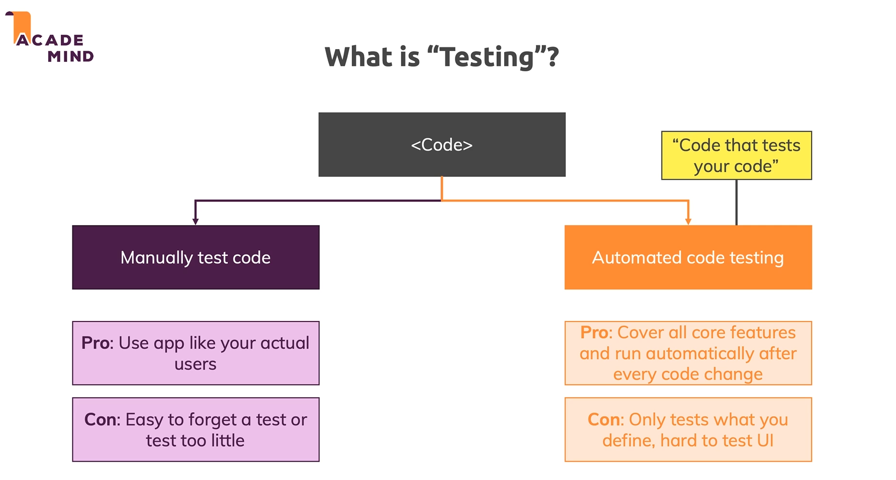

# Testing :

* 

* So need a combination of both manual testing and automated testing which will help to successfully test our applications.

## Why testing ?

* Automatic test allow us to test everything (atleast the tests we define) after every code adjustment.

* 

* 

## Setup and writing tests :

* Testing different kinds of node applications like GraphQL API require different tests.But here we learn the code ideas, the core concepts, the way of thinking about testing and the general setup which will always be the same no matter which node application we are building.

* To install mocha and chai run `npm i --save-dev mocha chai` which will install them as development dependencies.

* Then we add the command "test:mocha" to the scripts in package.json.

* When we run npm test mocha looks for a folder named `test` and runs the files inside it. So we create a folder named tests and store all of our tests in there.