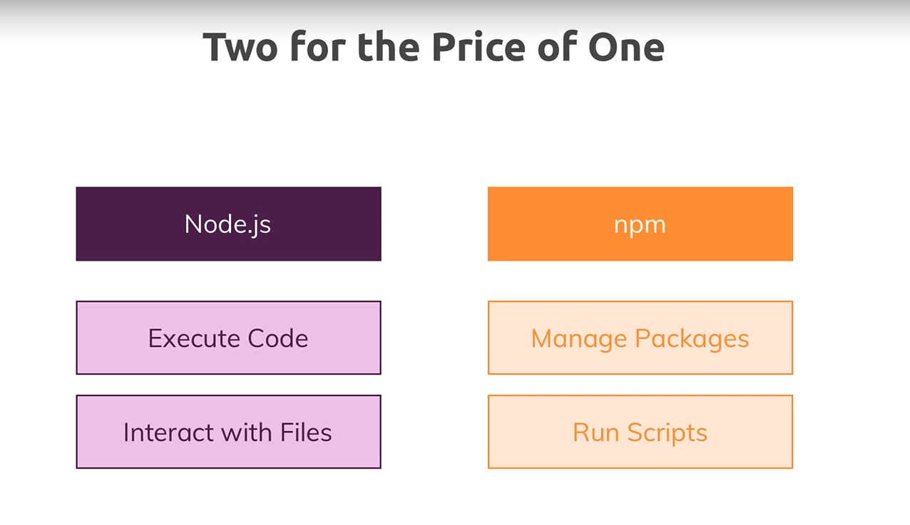
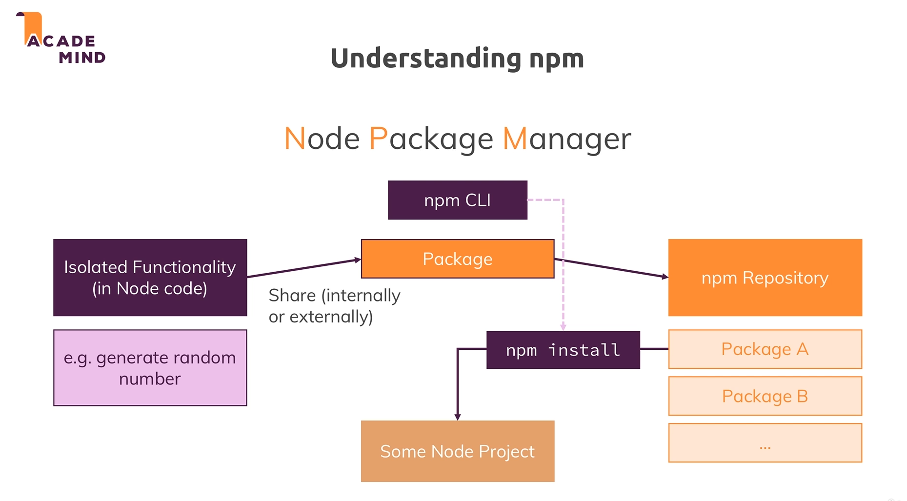

# npm and Node as a build tool :

* 

## npm :

* We can write some isolated node code and then share it internally or externally, we can put it into a package with the help of npm.

* We can use npm not just to install packages but to also share packages with other people using npm repository which is free cloud solution for sharing packages.

* 

* We can install a specific version of a package using `@` symbol just after the package name.

## Node as a build tool :

* 

* We want to convert unoptimized but manageable code with next-gen features to an optimized code. And node help us to do that but running scripts and hence acting as a build tool.

* So we use npm and node to transform our code.

* .

* npm will be used to run the scripts which in turn will execute the files and the code will be executed by node.

