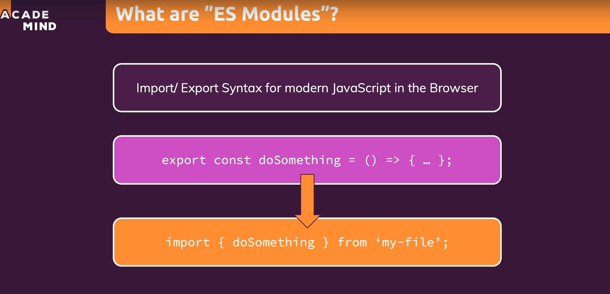
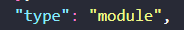

# Modern JS and NodeJS:

* 

## ES modules :

* 

* We can import and export using the new syntax by using the following ways :

    1) Renaming the file to .mjs.
    2) In the nearest package.json file we should make sure that the type config is set to "module". 

* Global variables like filename and pathname are not available in ES module syntax.

## Promises in Core API's:

* We havent use promises in core API's like fs, http, etc. The reason is when node js was created promises weren't a thing they didnt land in mainstream js. That is why they are callback based.

