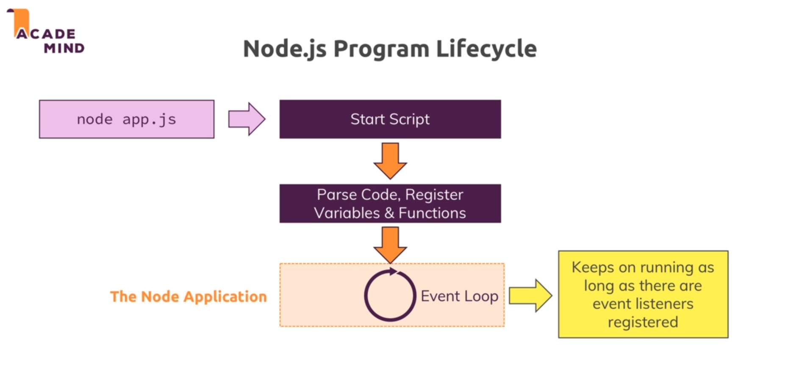
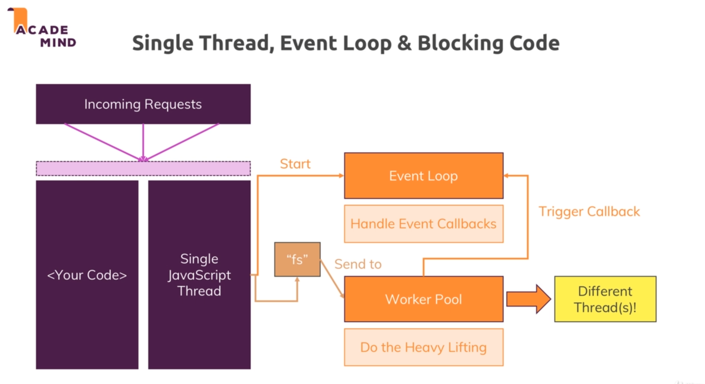
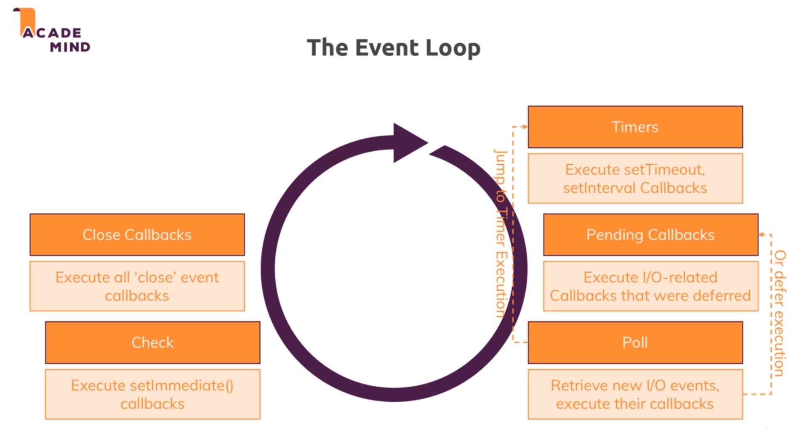

# Intro to NodeJS :

## Following are the core modules in nodejs:

1) fs(File System Module) : fs is a core module in nodejs. It provides a way to access the file system.It provides methods to read and write files.

2) path(Path Module) : path is a core module in nodejs. It helps us with path to files.

3) os(Operating System Module) : os is a core module in nodejs. It helps us with operating system relevent info.

4) http(HTTP Module) : http is a core module in nodejs. It helps us with lauching a server and sending requests to the other servers.

5) https(HTTPS Module) : https is a core module in nodejs. It helps us with lauching a ssl server.

## Event loop in node : 

* When we run our app.js file a new server is created and it does rest of the other stuff.

* After which it starts an event loop and this loop keeps on running as long as there are event listeners registered to this loop.

* In the app.js example we created a server with a request listener which listens to all the requests we make to our server.

* A way to end this event loop is through `process.exit()`.

## Requests : 

* <a href="https://developer.mozilla.org/en-US/docs/Web/HTTP/Headers">Response headers</a>

* Following explains the concept of streams and buffers : 

## Basic working of NodeJS:

* In JS there is only one JS thread which executes the JS code.

* So whenever the code execution starts the event loop starts and this event loop will handle all the event callbacks using the javascript thread.

* But all the async code including file system, database and api (anything that can block the code) are handled by the worker pool. They do all the heavy lifting and run on different threads. 

* After the worker pool are done doing their tasks they trigger the callbacks and the it is executed on the event loop which runs on a single javascript thread.

## Event loop:

* In a new iteration of an event loop it will first check for the timer callbacks .i.e. all the callback associated with setTimeout and setInterval functions.

* Then it executed the I/O related pending callbacks which are the callback left from the last iteration of the event loop.

* After the pending callbacks it goes to poll which is a phase where it searches for new I/O related events and executes their callbacks. 

* In poll phase the event loop can also defer the execution of a particular callback and add it to pending callbacks.

* Also in the poll phase it can jump to execute the time callbacks.

* After the poll it goes to the check phase where it execute setImmediate() callbacks. 

* At last it executes the close callbacks which executes all 'close' event callbacks.

* After this if there are no event listener or (ref=0 ref is counter of event listeners) it might call process.exit .

* When we create a server using createServer function there always is one event listener hence it will never exit the event loop automatically.

