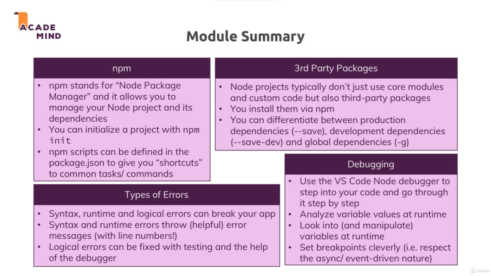

# Types of modules/features in Node:

## Global features
* Keywords like const or function but also some global objects like process
* Global features are always available, you don't need to import them into the files where you want to use them.

## Core Node.js Modules 
* Examples would be the file-system module ("fs"), the path module ("path") or the Http module ("http")
* Core Node.js Modules don't need to be installed (NO npm install is required) but you need to import them when you want to use features exposed by them.

    Example:

    const fs = require('fs');

    You can now use the fs object exported by the "fs" module.

## Third-party Modules
* Installed via npm install - you can add any kind of feature to your app via this way

* Third-party Modules need to be installed (via npm install in the project folder) AND imported.

* Example :

    In terminal/command prompt: ` npm install --save express-session`

    In code file (e.g. app.js): `const sessions = require('express-session');`

# Nodemon : 

* In the last lecture, we added nodemon as a local dependency to our project.

* The good thing about local dependencies is that you can share projects without the node_modules folder (where they are stored) and you can run npm install in a project to then re-create that node_modules folder. This allows you to share only your source code, hence reducing the size of the shared project vastly.

* The attached course code snippets also are shared in that way, hence you need to run npm install in the extracted packages to be able to run my code!

* Nodemon app.js would not work in the terminal or command line because we don't use local dependencies there but global packages.

* You could install nodemon globally if you wanted (this is NOT required though - because we can just run it locally): npm install -g nodemon would do the trick. Specifically the -g flag ensures that the package gets added as a global package which you now can use anywhere on your machine, directly from inside the terminal or command prompt.

# Errors

## Types of errors :

1) Syntax errors : Error in the syntax of the code.

2) Runtime errors : Errors which can only be detected after compilation.

3) Logical errors : Error which arise due to wrong logic.

# Module summary : 

