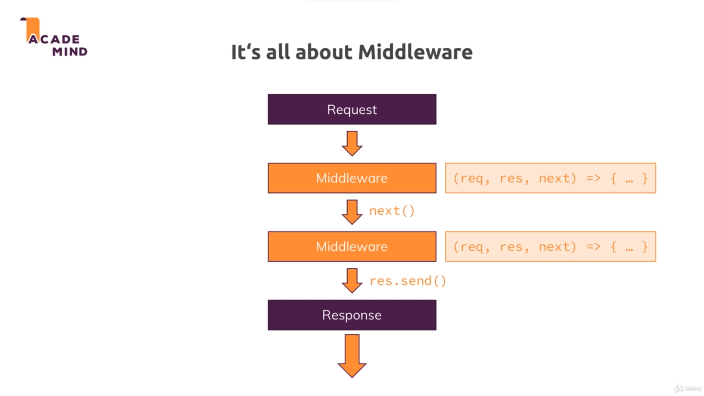

# Express :

* Express is a third party module which helps us write  code and focus on the business logic rather than dealing with nitty-gritty details.

* To add ExpressJS to our package we run `npm install --save express`.

## Middleware : 

* Express adds a lot of middleware to handle a request.

* So the request will go through multiple functions before we return back the response.

* This allows us to split our code into multiple blocks or pieces instead of having one huge function. And this is the pluggable nature of express where we can add other third party functions to handle requests.
