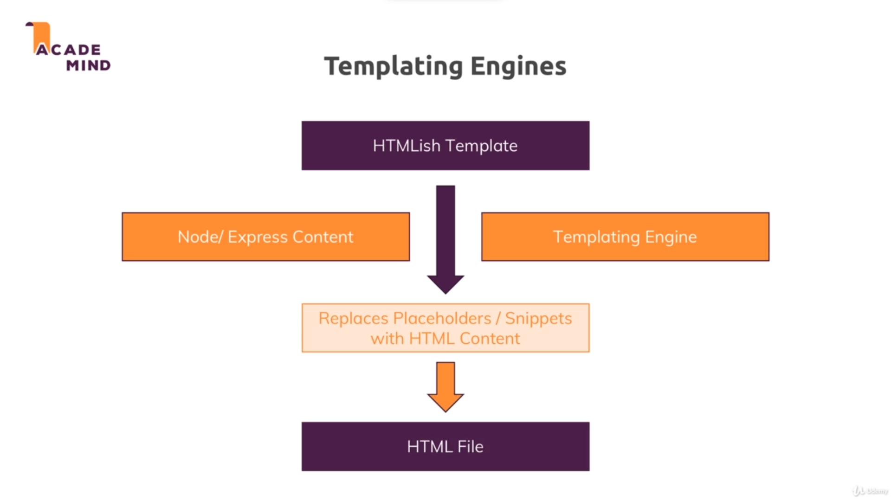
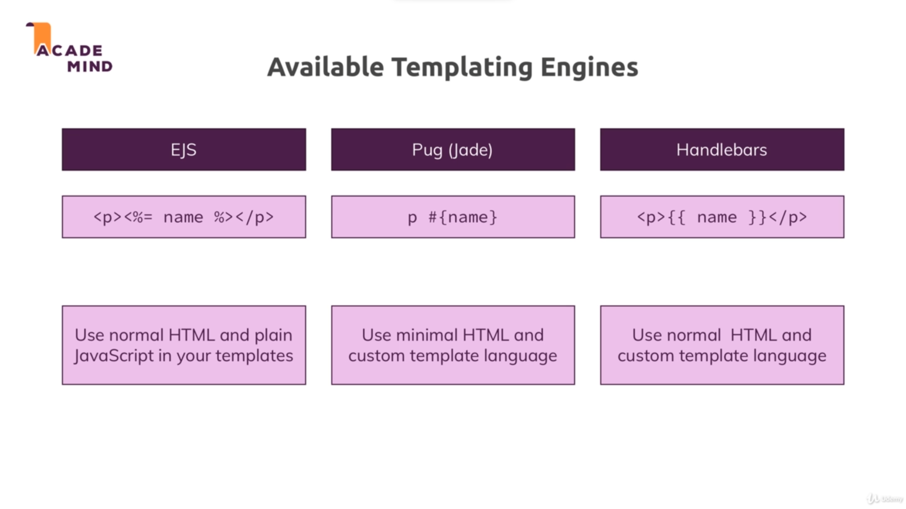

# Dynamic content and templating engines :

## Templating engines : 

* Template engine replaces the placeholders or code snippets in our code with real html content with the data from node/express.

* The html content is generated on the fly using the data from backend.

* Popular templating engines : 

* We install all the templating engines using : `npm install --save ejs pug express-handlebars`.

* We use express-handlebar since it already has compatability with express.