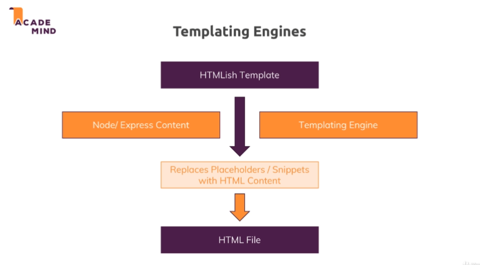
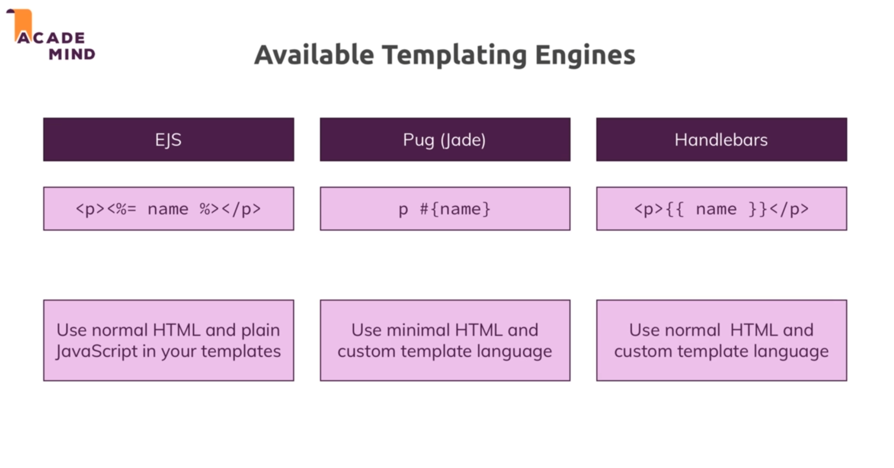

# Templating engine : 

* Templating engine takes in a HTMLish template code which contains some blanks for the data to be placed.

* Node/express contain the data which we want to place in the htmlish code.

* Templating takes the htmlish code and replace the placeholders/snippets with HTML content represent the data from the node server.

* The templating engine generates the html content on the fly by the templating engine taking the dynamic content into account (provided by the node app).

    

## Templating engines : 

* To install the templating engines run : `npm install --save ejs pug express-handlebars`.

* ejs and pug have built in compatibility with express wheareas for handlerbars we use express-handlebars.

## Pug (adding a layout) :

* Instead of using the copying the same pug content we can just have a template layout and just plug our codes into it.

* Since we are repeating many of the elements in every file hence we can have a layout and extend that layout from inside our other pug views and we can actually define some placeholders/hooks in our layout where other views can then enter their content.

* We can define such a hook by adding the block keyword which pug understands and then defining any name of our choice.

* We can use the block to enter content dynamically into other files.

* And then we can extend a layout by using the extends keyword and now we just need to point to the layout.

* And in the block content we add the content we want in our file.

* Checkout the `main-layout.pug` and `error.pug` to see the use of layouts.

* Also in pug we can use if/else statements as well as the for loop to perform different operations.

* For example for setting the active class in add-product.pug we pass the path during rendering and use that to deside the class we want to make as active.

* In this project we have used extends in add-product but not in shop.js to show the functionality of pug.

## Handlebars :

* Does not follow minimal HTML approach rather it follows normal HTML with some templating logic.

* Since handlebar uses normal html we can just use the error.html code and add some custom templating code.

* Also since we are already passing in code we don't need to change the JS files.

* The way we pass the dynamic content doesn't change for templating engines.

* To add dynamic content in handlebar template we use {{}}.

