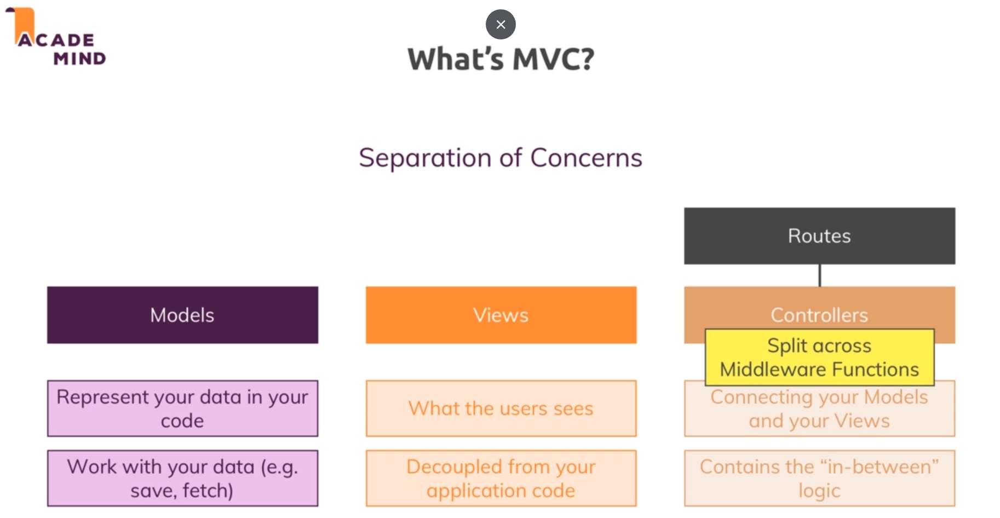
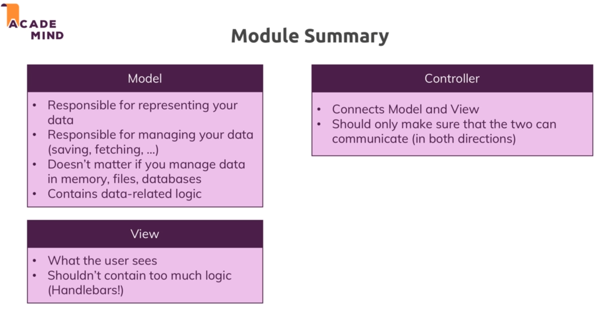

# Model-View-Controller :

* 

* Routes are what define upon which path for which http method which controller code should execute. 

* And then the controller is the thing with which model to work and which view to render.

* In an app built with express the controller is also split up accross middleware functions or some of the logic might be seperated and moved into another middleware function.

## Controller :

* We put the code related to rendering views in a controller and just export it in the routing file.

* Eg : we are exporting the getAddProduct callback function from the products controller to the admin routing file.

## Models :

* For models we create data structures which contains a constructor and various fields and methods.

* Constructor is called in js using the keyword news.

* We use the `static` keyword to define a function for the class rather than the object. So we can call a static function for a class rather than an object.

* 
